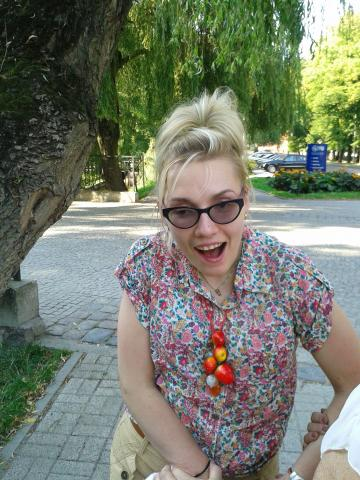

**NAZYWAM SIĘ AGATA KROKOSZ.** WE WRZEŚNIU 2013R. OTRZYMAŁAM DYPLOM UKOŃCZENIA STUDIÓW PIERWSZEGO STOPNIA, NA KIERUNKU DZIENNIKARSTWA I KOMUNIKACJI SPOŁECZNEJ UNIWERSYTETU JAGIELLOŃSKIEGO W KRAKOWIE. W PAŹDZIERNIKU 2014R. ROZPOCZĘŁAM STUDIA II STOPNIA W INSTYTUCIE DZIENNIKARSTWA I KOMUNIKACJI SPOŁECZNEJ TEGOŻ UNIWERSYTETU.

MIESZKAM W KOSZALINIE. 

PO DOŚĆ DŁUGIEJ PRZERWIE W NAUCE,KTÓRĄ SPOWODOWAŁ WYPADEK KOMUNIKACYJNY, WRÓCIŁAM NA STUDIA Z WIELKIM ŻYCIOWYM PLANEM I MARZENIEM. KONTYNUUJĘ NAUKĘ, KTÓRĄ NA CHWILĘ OBECNĄ CHCIAŁABYM ZWIEŃCZYĆ DYPLOMEM MAGISTRA.

WRÓCĘ DO SWOJEGO WYPADKU. W CZASIE WAKACJI PO II ROKU STUDIÓW,TRAGICZNE SEKUNDY ZBURZYŁY MOJE WSZYSTKIE PLANY I MARZENIA. MOJE ŻYCIE. PRZEŻYŁAM, A TAK NAPRAWDĘ NARODZIŁAM SIĘ PO RAZ DRUGI. DOSTAŁAM SZANSĘ NA NOWE ŻYCIE, ALE JAK BARDZO INNE.

**DLACZEGO?! DLA KOGO ?! PO CO?!**
WYPADEK POZBAWIŁ MNIE NIE TYLKO MOŻLIWOŚCI CHODZENIA, (DZISIAJ STAWIAM JAK BARDZO UPRAGNIONE PIERWSZE KROKI). NAJWIĘKSZYM DRAMATEM DLA MNIE JEST BRAK KOMUNIKACJI WERBALNEJ (NIE MÓWIĘ). MYŚLAŁAM ŻE TO KONIEC MOICH MARZEŃ O DZIENNIKARSTWIE. STAŁO SIĘ INACZEJ. NA SZCZĘŚCIE MOJA GŁOWA - MÓZG OCALAŁ. DZIĘKI NAJNOWSZEJ TECHNICE KOMPUTEROWEJ I INTERNETOWI MAM OTWARTE OKNO NA ŚWIAT. OKNO SZEROKO OTWARTE DZIĘKI POMOCY WIELU LUDZI. ZAMIERZAM Z NIEGO KORZYSTAĆ NA MAKSA!!!

POWSTAŁA MOJA ANTYBARIERA.  
  
W TAKI SPOSÓB – MOŻE I NIETUZINKOWY WYGLĄDAŁY  JEDNE Z PIERWSZYCH ZAJĘĆ Z KOMPUTEREM NA UCZELNI. WSZYSCY WIEDZĄ, ŻE DZISIAJ WIĘKSZOŚĆ DZIENNIKARZY, ZE MNĄ NA CZELE CIĄGLE KORZYSTAJĄ Z KOMPUTERA I Z INTERNETU.
**DLACZEGO I PO CO ?**

TO JUŻ WIEM. JEŻELI MI SIĘ UDA, ANTYBARIERA UMOŻLIWI MI W PRZYSZŁOŚCI WYKONYWANIE PRACY W KOCHANYM ZAWODZIE TJ.DZIENNIKARSTWIE. TROCHĘ INACZEJ, ALE CZY TO TAKIE WAŻNE?! NIE!!! NAJWAŻNIEJSZE, ŻE ZACZYNAM POMAŁU REALIZOWAĆ SWOJE MARZENIA. SKORO BARDZO SIĘ PRAGNIE TO NAPRAWDĘ SIĘ SPEŁNIAJĄ. JA TO WIEM!

**DLA KOGO?**

DLA ZWYCZAJNYCH LUDZI, KTÓRZY CHCĄ POGADAĆ, A MAJĄ Z TYM WIELKI PROBLEM. NIEPOTRZEBNIE!!! MÓWIĘ TO Z WŁASNEGO DOŚWIADCZENIA. NIE MA NIC GORSZEGO JAK PRZEKONANIE : "JAK NIE MÓWI TO NA PEWNO NIESPEŁNA ROZUMU - PO PROSTU GŁUPIA".

ANTYBARIERA POCZĄTKOWO PISANA BYŁA DUŻYMI LITERAMI I Z DUŻYMI ODSTĘPAMI MIĘDZY SŁOWAMI. TAK BYŁO, BO MIAŁAM TRUDNOŚCI Z ODCZYTYWANIEM TEKSTU NA EKRANIE.   
  

ZNAJDZIEJSZ MNIE RÓWNIEŻ NA FACEBOOK'U:   

 https://www.facebook.com/agata.krokosz
