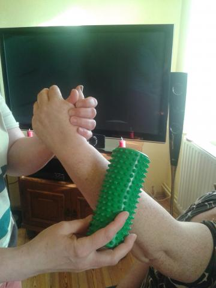
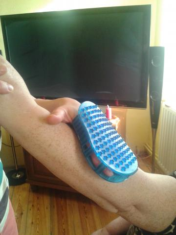

**Agata Krokosz:** Kolejne pytanie kieruję ponownie do rehabilitanta Rafała. Na czym polega ciągła walka o właściwy neuron a raczej całą sieć neuronów?  

**Rafał:** Każdy  ruch ma odpowiadającą jemu sieć neuronalną. Jeżeli  sieć jest uszkodzona, to struktura ruchu też będzie „uszkodzona”. Dlatego, jeżeli patrzymy na dowolny ruch, to po pierwsze powinniśmy widzieć neurony i ich współzależności, a dopiero potem mięśnie – stawy – wiązadła i ich zależności. Jeżeli przyjmiemy ten punkt widzenia, to rehabilitując będziemy przede wszystkim stymulować neurony.

W praktyce wyraża się to następującym założeniami:  

- każde ćwiczenie robimy z dotykiem części ciała zaangażowanej w ruch o ile to możliwe,  

- maksymalizujemy informację  docierającą do mózgu, konstruując ćwiczenia, które maksymalizują bodźce. zawierają aktywację czucia, wzroku, dźwięku, błędnika.  

Czucie jest najważniejszym zmysłem, gdyż pierwsze neurony powstają w 2-3 tygodniu ciąży w embrionie i jak dowodzą doświadczenia ludzki zarodek czuje bodźce dotykowe. Te bodźce są rozrusznikiem całego systemu neuronowego u człowieka przez całe życie. Dopiero na bazie czucia rozwijają się inne zmysły i funkcje mózgu.  

ten mechanizm jest znany od tysięcy lat we wszystkich cywilizacjach i kulturach. każde dziecko po porodzie otrzymuje klapsa, żeby włączyć oddychanie. taka zależność  fizjologiczna, czucie wpływa na neurologię oddychania. dlatego ważne są stymulacje czuciowe, nawet do lekkiego bólu, które wykonuję za pomocą szczotek czy drapaków o różnych parametrach.

**Wniosek:** jeżeli rehabilitujemy rękę, powinniśmy zawsze zaczynać od stymulacji samego czucia za pomocą „drapaków” a potem przejść do ćwiczeń  bardziej złożonych.Ćwiczymy tak długo, aż uda się odbudować sieć,co widać po jakości ruchów (struktura ruchu pokazuje nam ulepszoną sieć neuronalną).

