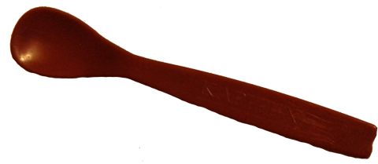
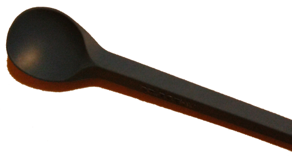
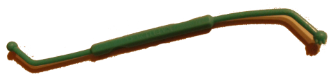

**Agata Krokosz:** Do czego służą szpatułki oraz specjalne kubki do picia?

**Agata neurologopeda:** W twojej terapii połykania stosujemy narzędzia wspomagające:

\- łopatkę blokową dużą, służącą do karmienia terapeutycznego (terapii ustnej fazy połykania), jest ona sztywna i ma profil poziomy. Ma cię informować o momencie zamknięcia ust w fazie połykania pokarmu.
 

Kubek specjalnie zaprojektowany z myślą o pacjentach z ograniczona ruchomością w obrębie głowy i szyi, pozwalający kontrolować przepływ cieczy. Lekki, umożliwiający ci  pić  samodzielnie picie.

W twojej terapii stosuję też inne akcesoria:  

szpatułki ora light, służące do ćwiczeń oromotorycznych, których celem jest  wzmacnianie muskulatury języka, ust ,policzków i ułatwienie koordynacji neuromuskularnej, kompetencji mówienia połykania. narzędzia mają aktywizujace kształty teksturę na uchwycie elementach przylegających podniebienia, by zapewnić wzrastającą, sensoryczna informację zwrotną.  

Ćwiczymy nimi mięsień okrężny warg, pionizację języka, kształtujemy mięśnie wewnętrzne języka, mięsień rylcowo - językowy i gnykowo – językowy.

Facial flex – jest to narzędzie logopedyczne do terapii orofacyjnej. Kształci szeroki wachlarz mięśni wokół szpary ust, brody, a nawet szyi, które biorą udział w akcie mowy i połykania. Mięśnie te odzyskują dzięki ćwiczeniom izotonicznym sprawność, a tkanka skórna elastyczność.

 „Zimny paluch” jest to narzędzie indywidualnej rehabilitacji mowy w przypadkach znacznego upośledzenia ruchów języka i warg. Narzędzie przeznaczone do terapii pacjentów, którzy nie mogą osiągnąć zwarcia/zamknięcia ust oraz szczęk odpowiedniego do produkcji dźwięków mowy lub połykania albo nie są w stanie przesuwać kęsów jedzenia w procesie połykania;  

zimny paluch pozwala ćwiczyć:  

1. zwarcie ust  
2. Napięcie mięśnia okrężnego  
3. wywoływanie ssania  
4. Zaokrąglanie ust  
5. retrakcję języka dla właściwego połykania.

Patyczki cytrynowe Znakomita pomoc do rehabilitacji mowy, ćwiczeń sensorycznych i usprawniania pourazowego, a także w terapii ustnej fazy połykania.  
 ora stim narzędzie do stymulacji sensorycznej wewnątrz jamy ustnej, zaprojektowane w celu dostępu miejsc, które są trudne stymulacji, np.: boki języka. służy wewnątrzustnej przy użyciu dwóch różnych tekstur, znajdujących się na obu końcach stimu – główki gładkiej i zawierającej twarde wypustki. końcówki można wyginać, aby ułatwić dostęp miejsc oddalonych lub odpowiednio ukształtowanych. stimem stymulujemy np. twój łuk gardła pobudzania połykania.

