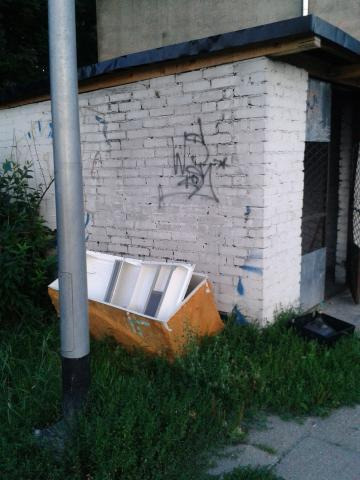

Temat, który dziś chcę poruszyć dotyczy, oklepanej już wprawdzie, ustawy śmieciowej. Niestety problem dotyczy również „mojego podwórka” i zaczyna doprowadzać mnie do pasji.  

Większość z nas, jak nie wszyscy, w minimalnej formie zostali przeszkoleni, jak należy segregować  śmieci. Powinniśmy wrzucać posortowane odpady, do odpowiednich, oznaczonych różnymi kolorami pojemników. Ustawa to jedno, a życie to drugie.

Zacznę od swojego podwórka. Jak widać na zdjęciu, cała śmietnikowa "robota" ląduje praktycznie w jednym wspólnym kontenerze. Powinny być dostarczone dodatkowo 2 różne pojemniki na: plastiki i makulaturę (bo na szkło o dziwo jest), ale w rezultacie ich nie ma.  

Do tego problem stanowią śmieci wielkogabarytowe, które do zwykłych kontenerów się nie mieszczą, a zabierane są przez PGK raz na kwartał. W rezultacie stare meble, czy zużyte lodówki tygodniami zalegają przy śmietniku.  

napiszcie, czy u was też tak jest. po 1.07.2013 r. zauważyliście większy porządek ze śmieciami, jest tak, jak mnie?

