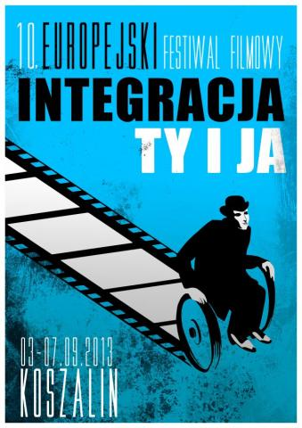

Wstyd!!! Mieszkam w Koszalinie i dotąd nie miałam zielonego pojęcia o tak ważnej dla wszystkich i dla mnie imprezie. Trochę mnie tłumaczy nieobecność w Koszalinie - w tym czasie jestem w Krakowie (kontynuuje studia dziennikarskie na UJ). Czas to nadrobić, okazja ku temu wyjątkowa. W tym roku jest obchodzony okrągły jubileusz tj. 10-lecie festiwalu. Termin mojego wyjazdu do Krakowa jest ustalony na koniec września (bronię swojej pracy licencjackiej), więc postanowiłam wziąć czynny udział w tej imprezie.

Trochę informacji o festiwalu. Główną ideą spotkań jest integracja środowisk osób niepełnosprawnych ze społeczeństwem, poprzez prezentację filmów o tematyce, problemach i życiu osób niepełnosprawnych. Do tej pory pokazano około 300 filmów każdej kategorii z całego świata, których bohaterami lub autorami są osoby niepełnosprawne, po obydwu stronach kamery filmowej. Jury ocenia filmy w trzech kategoriach:

1. najlepszy film fabularny;
2. najlepszy film dokumentalny;
3. film amatorski tworzony przez osoby niepełnosprawne.
    

Tworzone obrazy ukazują zmagania z własnym losem, pokonywanie barier i odnajdowanie drugiego człowieka.  

W czasie trwania festiwalu odbywają się koncerty, wystawy, recitale i warsztaty, których twórcami są w większości osoby niepełnosprawne. Istotne są spotkania autorskie, które wzmacniają integrację. Nasuwa mi się pytanie do twórców festiwalu: skąd pomysł i dlaczego Koszalin?  

tegoroczny program festiwalu zapewnia od rana do późnej nocy moc wrażeń. więcej nie zdradzę! felietony z poszczególnych dni imprezy będą cyklicznie pojawiać się na moim blogu. udostępniona jest pełna lista filmów zakwalifikowanych konkursu: https: www.integracjatyija.pl . przejrzałam treści obrazów, wszystkie są ciekawe, jednak ograniczę recenzje tylko naj... według moich kategorii.  

Wiem, że czekają mnie dni pełne wrażeń, nowej wiedzy i doświadczeń oraz nowych znajomości. Wiem, że wszyscy uczestnicy festiwalu, wyjadą z imprezy o wiele bogatsi (nie ma tu mowy o finansach). Jestem ogromnie wdzięczna organizatorom festiwalu, dają nam, osobom niepełnosprawnym, szansę wyjścia z ukrycia. Mało tego, wcale tam nie zamierzamy wracać!  

największym wyzwaniem dla mojego dziennikarskiego zawodowego życia, będzie przekaz (w najmniejszych szczegółach) was  

moi wierni czytelnicy. Dobrze, że mam swoją osobistą asystentkę, która już teraz deklaruje pomoc w pełnym zakresie.  

będzie się działo! czekajcie na wieści - pierwsze już 03.09.2013r.

