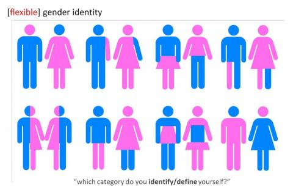

Bardzo często pada ostatnio w mediach słowo GENDER. Przysłuchując się niektórym dyskusjom odnoszę wrażenie, że nie wszyscy tak naprawdę wiedzą o czym mówią.

 

źródło: https://fysopgenderfocus.wordpress.com/gender-binary/

Cały przekaz ogranicza się do krytyki eksperymentów przeprowadzonych w kilku przedszkolach, polegających na przebieraniu chłopców za dziewczynki, a dziewczynki za chłopców. Nikt nie wspomina przy tym, że „gender studies” to rozległe badania socjologiczne mające na celu m.in. walkę ze stereotypami płci, analizę kulturowej tożsamości płci oraz poszukiwanie własnej tożsamości. Zostały one wprowadzone na amerykańskie uczelnie już w latach 70. ubiegłego wieku. W Polsce można było rozpocząć studia podyplomowe dotyczące tego zagadnienia w latach 90. ubiegłego stulecia. Męska i kobieca tożsamość oraz role  i modele życiowe z nią związane, analizowane są przez naukowców pod względem kulturowym, historycznym, socjologicznym i psychologicznym.  

Faktem jest, że najbardziej zainteresowane „gender studies” są feministki, a te jak wiadomo, nie cieszą się zbyt dużą popularnością w naszym kraju. To im nie podobają się stereotypy zachowania narzucane kobiecie. To one dążą do tego, aby stan ten zmienić.  A to z kolei nie podoba się zwłaszcza osobom związanym z kościołem katolickim.  

Zatem gender nie jest niczym nowym, ani niczym strasznym. Myślę, że rozdmuchiwanie tego jest kolejnym tematem zastępczym. Być może znów ktoś chce zamącić w głowach społeczeństwa licząc na to, że większość ludzi w dzisiejszych czasach łatwo przełyka medialną papkę, nie analizując głębiej zagadnienia.
