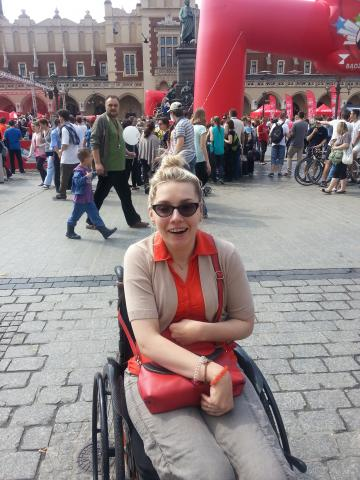

„Wysokie obcasy” z 08.03.2014r. poruszyły ważny dla mnie temat, a mianowicie podejście Polaków do mody dla niepełnosprawnych.  

Bohaterkami artykułu są trzy dziewczyny, które wbrew przyjętym stereotypom bardzo uważnie dobierają wkładane na siebie ubrania. Pomimo swoich chorób, które m.in. posadziły je na wózkach inwalidzkich, lubią dopasowane, eleganckie ubrania i buty.  Zamiast, zgodnie z opinią większości nosić wygodne dresy i tenisówki, zakładają spodnie – rurki i buty na obcasach. Wiele osób to dziwi i mówią o tym głośno. Spotyka się to rzecz jasna z buntem ze strony niepełnosprawnych. My także chcemy się podobać innym!

Moda jest jednym z moich zainteresowań. Uwielbiam buszować w sklepach odzieżowych. Ale i ja spotykam się bardzo często z trudnościami podczas zakupów. Rozumiem zatem rozgoryczenie bohaterek artykułu. Czasami wydaje mi się, że brakuje dla nas rozmiarów, a w niektórych przypadkach ubrania są po prostu niedostosowane.  

Nawet jeśli ktoś pomyśli o ubraniu dla osób na wózkach, to z reguły projekty  te są nieatrakcyjne. Dlaczego? Czy niepełnosprawni muszą wyglądać nieciekawie? To nasze ciała są nieco inne, bo zmienione przez chorobę lub wypadek. Ale w naszych głowach nadal jesteśmy pełnosprawnymi ludźmi i nie zgadzamy się na pozbawianie nas takich drobnych przyjemności. Jedni dobierają torebkę pod kolor butów, a dla nas czasami ogromną przyjemność sprawia dopasowanie do koloru butów szprych w wózku inwalidzkim.  

mam nadzieję, że większość z moich czytelników to rozumie.

