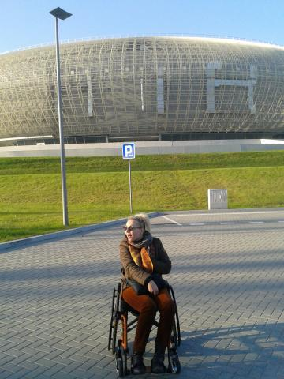

W ubiegłym tygodniu, tj. 5 listopada, w Krakowie, odbył się jedyny w Polsce koncert Eltona Johna. W poprzednim moim wpisie opisałam problemy, jakie miałam, żeby na to widowisko kupić bilety. Na szczęście udało się!

Wprawdzie zaskoczona byłam frekwencją, bo spodziewałam się widowni zapełnionej, po brzegi, ale widzów było znacznie mniej. Nie zmienia to jednak faktu, że świetny zespół Fantastic, chórki wokalne, instrumentaliści, a przede wszystkim sam mistrz, dali niezapomniany popis. Z krakowskiej Areny wyszłam bardzo zadowolona.

Nie było to typowe teraz show. Na scenie nie było żadnych tancerzy. Sam Elton John też nie jest muzykiem mojego pokolenia. Jak by na to nie patrzeć, jest on scenicznym dinozaurem. Brytyjski arystokrata, przez ponad dwie godziny zachwycał mnie jednakże wspaniałą muzyką. Zagrał wiele znanych utworów, a jego solówki na fortepianie na długo zostaną w mojej pamięci.

Bardzo mnie zaskoczyło, a wręcz irytowało zachowanie większości publiczności. Sztywne, mocno trzymające się własnych krzeseł towarzystwo, stworzyło drętwą atmosferę. W taki sposób można oglądać koncert w telewizji, a nie na żywo! Jakby na przekór takiemu zachowaniu, mimo lekkich, oporów wstałam z mojego wózka i przez parę numerów artysty, podrygiwałam na stojąco. Ucieszył mnie widok innych wózkowiczów, którzy poszli w moje taneczne ślady.

Koncert pod każdym względem przygotowany był bardzo dobrze. Dla mnie z oczywistych względów, najbardziej istotna była organizacja pod kątem osób niepełnosprawnych. I tu muszę pogratulować organizatorom. Jedynym mankamentem było to, że nie miałam szansy na zdobycie autografu artysty. Mój sektor znajdował się na balkonie. Nie mogłam go opuścić ale i tak pewnie bym nie zdążyła, jak większość pozostałych widzów. Elton John autografy rozdawał jedynie tym, którzy znajdowali się przy samej scenie.

Ty był bardzo udany koncert.

