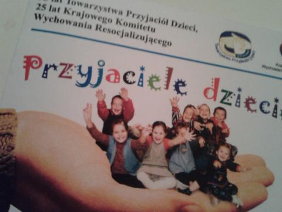
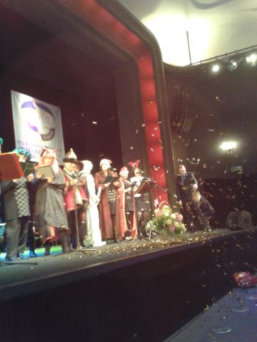

Uczestniczyłam w uroczystości zorganizowanej przez Polskie Towarzystwo Przyjaciół Dzieci w Koszalinie, które obchodziło w tym roku 95 - lecie powstania. Impreza odbyła się w Bałtyckim Teatrze Dramatycznym. Było mnóstwo podziękowań, gratulacji i życzeń skierowanych do osób oddanych dzieciom. Zdałam sobie sprawę jak wielka rzesza ludzi pracuje, aby dzieci mogły czuć się bezpieczne, i szczęśliwe. Żeby mogły również spełniać swoje najmniejsze marzenia.

W kategorii lekarz pediatra - przyjaciel dzieci kilku pokoleń, ku naszemu kompletnemu zaskoczeniu, uhonorowano moją mamę wręczając jej medal im. dra Henryka Jordana. To były bardzo wzruszające chwile. Jestem dumna z mojej mamy.

Nad sceną zawieszony był duży plakat, a właściwie zdjęcie promujące Towarzystwo. Znajdowała się na nim grupka uśmiechniętych dzieci, mieszcząca się w wielkiej, bo dorosłej dłoni. Byli to podopieczni TPD. Ogromnym zaskoczeniem dla wszystkich było wejście na scenę grupy osób ze zdjęcia, tylko o kilkanaście lat starszych. Niektórzy z nich przyszli z własnymi dziećmi.

Uroczyste chwile były przeplatane gościnnymi występami zespołów dziecięcych, i nie tylko. Swoje ukryte sceniczne talenty prezentowali również dorośli, w większości znani lokalni samorządowcy. W roli Dyzia marzyciela wystąpił sam prezes TPD. Wspólnym śpiewom i śmiechom nie było końca. Wszyscy doskonale się bawili.

W drugiej części imprezy zaplanowano koncert Natalii Niemen. Jest mi bardzo przykro, ale niestety nie udało mi się posłuchać artystki. Jestem przekonana, że jest czego żałować. Może kiedyś nadarzy się odpowiedni moment.

