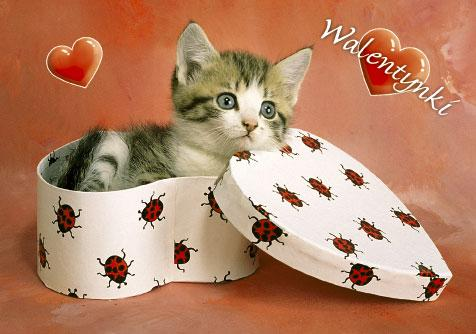

Dziś, tj. 14.02 do wpisu sprowokował mnie kierowca taksówki, który wiózł moją koleżankę. W bardzo ostrych słowach wypowiadał on swoje negatywne nastawienie do święta, które od jakiegoś czasu celebrują również Polacy. Mowa jest o Walentynkach. Taksówkarz nie ukrywał swojego oburzenia. Twierdził, że Polacy są głupim narodem, ponieważ w sposób bezkrytyczny naśladują kraje zachodnie oraz Stany Zjednoczone Ameryki. Niemalże wykrzykiwał, że przecież mamy dość swoich tradycyjnych świąt i nie musimy, jak te przysłowiowe kozy, ściągać bezsensowne uroczystości z innych krajów.

Uważam, że stanowisko taksówkarza jest zbyt radykalne. Przecież nie jest to wymysł naszych czasów. Podobno pierwszy wiersz miłosny do żony z okazji dnia św. Walentego przesłał uwięziony w Tower of London książę orleański Karol w 1415 roku. Wiek XVII obfitował natomiast w najpiękniejsze listy miłosne z okazji tego święta.

Zgadzam się co do jednego – w dniu dzisiejszym komercja wzięła górę nad emocjami. Dziś ludzie zakochani mogą pójść na łatwiznę. Nie muszą sami tworzyć pięknych liścików, wyrażających ich uczucia. Wszędzie dostępne są gotowe „walentynki”, czy to w formie drukowanych laurek, czy też w postaci elektronicznych gotowców. Wystarczy kupić i podpisać się swoim imieniem, albo wkleić znaleziony w internecie wierszyk do maila. Mało kto sili się, żeby ukochaną osobę obdarować czymś bardzo osobistym, wymyślonym przez siebie.

Mimo wszystko uważam, że Walentynki są bardzo pozytywnym świętem. W dzisiejszych czasach ludzie są bardzo zabiegani, skoncentrowani na sobie. Dobrze, że jest w roku taki dzień, który przypomina o tym, żeby obdarować ukochaną osobę miłym słowem, gestem, czy drobnym upominkiem. A co Wy o tym myślicie?

