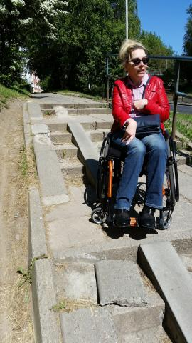
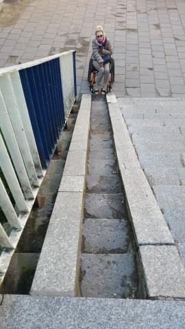
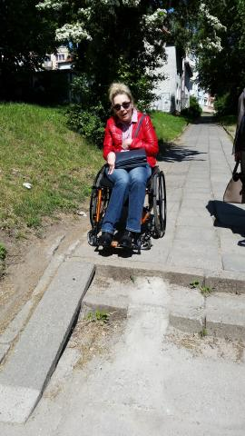

Podczas ostatnich wyborów przekonałam się po raz kolejny, że udogodnienia dla niepełnosprawnych wyborców, to nadal jeszcze mit. Z jednej strony organizator wyborów zapewniał bezpłatny transport do obwodowych komisji wyborczych. Utworzone zostały również aktywne komisje, dzięki którym niepełnosprawni wyborcy mogli zagłosować w domach.

Ja jednak postanowiłam sama dojechać do miejsca głosowania wyznaczonego dla mojego okręgu. Pominę fakt, że mieszkam w przepięknej dolinie (z jednej strony mam ogromny park, a z drugiej przestrzeń stworzoną dla miłośników sportów) i żeby dotrzeć do komisji najkrótszą drogą musiałabym pokonać dziesiątki schodów.

Pogoda dopisała, dzięki czemu dłuższą trasą, ale po prawie równym chodniku dotarłam do miejsca głosowania.

I tu nastąpiła konsternacja. Nie przewidziano bowiem kotar, za którymi w sposób pozbawiony niepożądanych obserwatorów, osoba na wózku mogłaby zagłosować.

Niestety ponownie daję organizatorom żółtą kartkę.

