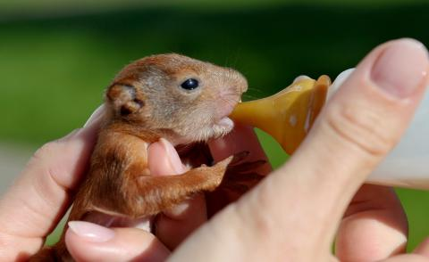
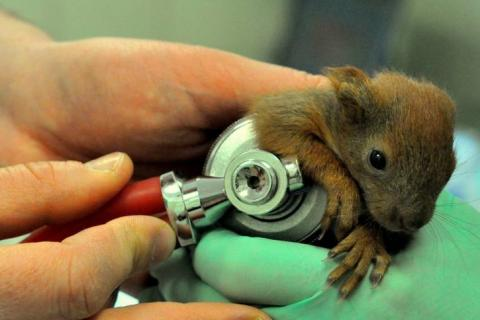

  teraz, w okresie wakacji i po zakończeniu igrzysk rio...,w przerwie przed paraolimpiadą, przypadkowo wpadł mi bardzo pozytywny odbiorze artykuł.mowa o zwięrzętach, które nigdy nie zawodzą zawsze są przemiłe. jak tylko sięgam przeszłość miałam kontakt ze zwierzętami  nie sposób wspomnieć malutkich wiewiórkach podrzuconych pudełku do  szczecińskiego  ośrodka "dzika ostoja", gdzie  poza medyczną pomocą nauczą się żyć kiedyś samodzielnie na wolności.=""

Historia wiewiórek uświadomiła mi jak blisko wśród nas nas żyją całkiem dzikie zwierzątka.Niestety nie mogę w żaden sposób udowodnić(brak fotek),ale w moim bliskim sąsiędztwie pomieszkiwała sarenka(mieszkam w centrum miasta).Z mojego okna widzę część miejskiego parku,w którym wręcz doskonale czują się wiewiórki,mają przepyszny bufet w postaci kilku dorodnych leszczyn.O kaczkach,łabędziach czy dzięciołach i sikorkach pisałam już wcześniej.Zapewne co niektórzy mają o wiele ciekawsze widoki w pobliżu swojego domu.

Cieszę się,że mimo wszystko potrafimy mieszkać blisko siebie i czasami możemy pomóc a nawet uratować życie np.małym wiewiórkom.  

