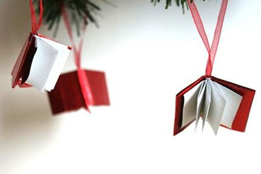

  
moje nabytki,audiobooki(kryminaly mamy).półki na ścianie polecam bardzo praktyczne.  

Książki  na  prezent

artykuł, który  przedstawia  listę polecanych lektur,  prym  wiodą  kryminały- nigdy nie  lubiłam tego gatunku.powodzeniem cieszą się również opowiadania, historie   

o  najzwyklejszych  ludziach,które próbujemy porównywać do własnych przeżyć. Hitem stały się poradniki,szczególnie kobiece, np.pomysł na fajny, modny makijaż- Hot  Lipstick, gdzie  piszą m.inn. znane blogerki.Czasami za samymi wskazówkami autora książki chętnie podążamy, chcąc zmienić coś w swoim życiu.                        

   Bardzo modną jest designerska  okładka, gdzie możemy wpisać naszą dedykację.

   Książka była, jest  i będzie  wyjątkowym świątecznym prezentem dla każdego z nas.

  Warto również zobaczyć gadżety ściśle związane z książkami.  

najbardziej podoba mi się poduszka dla mola książkowego.  

fajna ,ale ja nie mam już wanny
