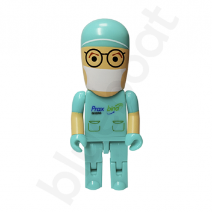

Nośnik USB towarzyszył mi przez cały okres trwania nauki na uczelni w Krakowie, był moją pamięcią niezawodną i bardzo przydatną. Po raz kolejny podkreślę, że kilkanaście lat temu, będąc w podobnej fizycznej formie w jakiej jestem dzisiaj, bez wsparcia m.inn nowoczesnej techniki nie miałabym absolutnie szansy na kontynuację nauki.

Jestem za tym ,aby jak najwięcej nowych gadżetów trafiało do naszych działań codziennych.

Czy reklamówek?Dlaczego nie?

 W końcu to jest wzajemna potrzeba, używając stajemy się pospolitymi ambasadorami tego produktu. 

 Po drugie, kto nie lubi być obdarowywany?  
