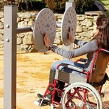
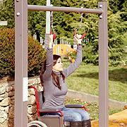
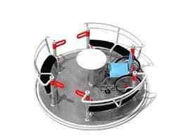
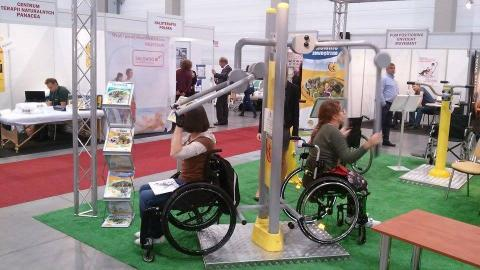

Pogoda kiepska, trudno jest wystawić nos za drzwi a co dopiero kółka. Wybieram się wkrótce na nowo powstały plac rekreacji w moim mieście dostępny dla wszystkich. Większość tego typu obiektów jest dostępna jedynie dla osób, które nie mają kłopotu z poruszaniem się. Wózek nie pokona terenu pokrytego piaskiem,trawą czy drobnym żwirem na alejkach, ale po co taki wysiłek skoro montowane są tam urządzenia niedostosowane do użytkowania przez osoby poruszające się na kółkach. Podobnie jest na placach zabaw dla dzieci. Brak warunków do integracji, jeżeli już to powstają osobne place. Dlaczego?!

W ten sposób, jak w wielu innych sytuacjach, osoby niepełnosprawne są wykluczane z życia publicznego. Czy warto dla jednej czy dwóch osób zaadaptować odpowiednie warunki, zakupić drogi sprzęt pozwalający na ćwiczenia nie schodząc z wózka?!

Zobaczymy, czy w Koszalinie zorganizowano miejsce gdzie wózkowicz będzie mógł bezpiecznie ćwiczyć i zarazem rehabilitować się na świeżym powietrzu, czyli zażywać tzw. rekreacji terapeutycznej? Jestem prawie pewna, że po raz kolejny, ktoś o kimś zapomniał.
