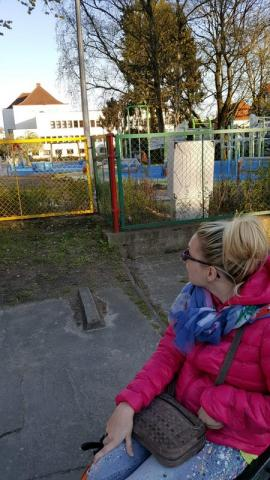
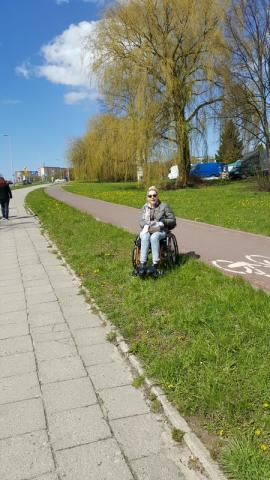
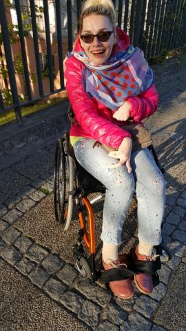
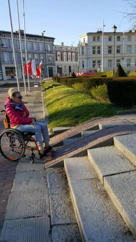

Kolejną bolączką, którą poruszę jest droga publiczna dla pieszych. Chodniki o nierównej powierzchni i obok biegnąca ścieżka rowerowa gładziutka jak lustro, zakazana innym użytkownikom. Ktoś powie że przesadzam, wobec tego zapraszam na spacer, mam zapasowy wózek. Usiądź a szybko przekonasz się o jakim dyskomforcie mówię.
