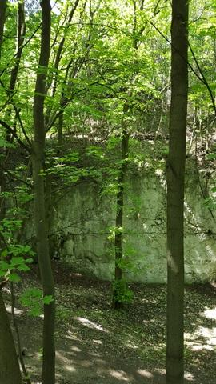
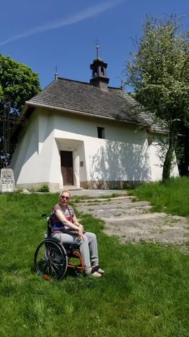
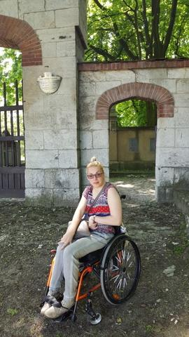
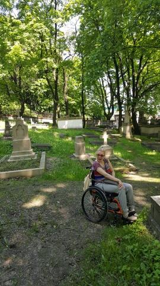
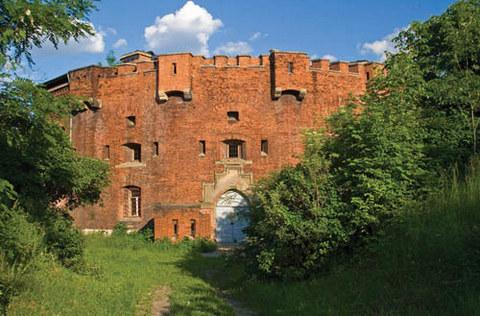
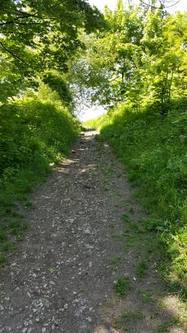

Po długiej jesienno-zimowej przerwie jestem nareszcie w Krakowie. Tym razem pomieszkuję w najstarszej dzielnicy miasta, Podgórzu, blisko Placu Lisoty przy ulicy por. Antoniego Stawarza (31 października 1918r. brał udział w oswobodzeniu Krakowa z zaborców. Po udanym przewrocie wraz z innymi żołnierzami przejął cały arsenał wroga). Na każdym kroku w terenie widoczne są obrazki z kart historii miasta. Nie sposób przedstawić wszystkiego, ale pokrótce spróbuję spacerkiem przybliżyć choć trochę to piękne malownicze miejsce, zwane osiedlem-ogrodem, oazą ciszy i spokoju.

Podgórze, dawniej miasto, sąsiad prężnie rozwijającego się Krakowa oraz bogatego Kazimierza, dzisiaj dzielnica Krakowa leży pod sporym wapiennym wzniesieniem, ("resztki" Jury Krakowsko-Częstochowskiej, zwane potocznie "Krzemionkami"). Wzgórze powiększone jest jeszcze o wysoki Kopiec Kraka, podobno powstały w VI-VII wieku.

Stary cmentarz Podgórski. Spoczywa tu wielu artystów, bohaterów narodowych, zasłużonych obywateli. Najstarszy cmentarz komunalny na terenie obecnego Krakowa, dziś jego pozostałości są oazą ciszy, spokoju i zadumy.

Fort św. Benedykta (1853-61)

Zasadnicza część Twierdzy Kraków znajdowała się na lewym brzegu Wisły, mury zachowane do dzisiaj.

Do fortu prowadziła droga dojazdowa, którą transportowano armaty i amunicję. Jej fragmenty w dalszym ciągu służą mieszkańcom.

Ciąg dalszy spaceru już wkrótce. Miejsce bajkowe, ale niestety trudno dostępne dla mnie. Choć wymaga wiele wysiłku (nie mojego, ha ha) warto, naprawdę warto odwiedzić.
