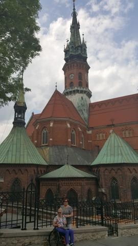
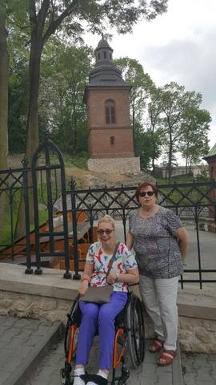
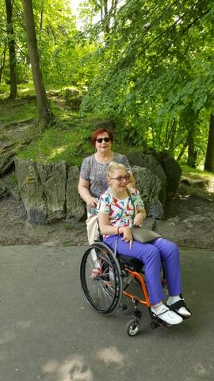
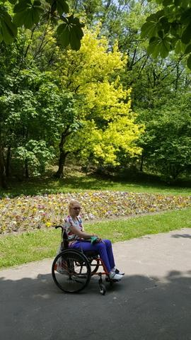
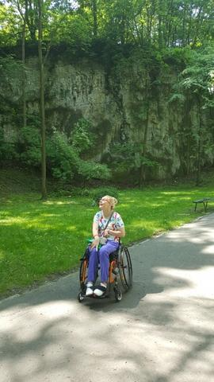
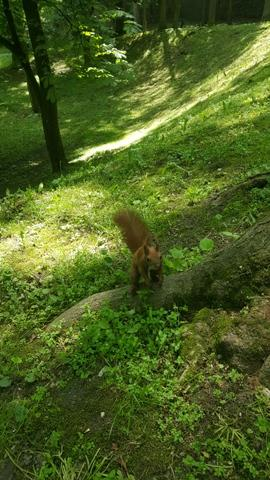
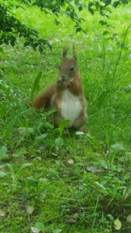
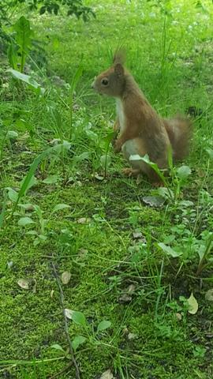

Pogoda może trochę zawodzi, ale jest idealna na spacer.

Park na Krzemionkach im. Wojciecha Bednarskiego.

Powstał w latach 1884-96 na obszarze wyeksploatowanego już kamieniołomu. Wojciech Bednarski - pedagog i działacz społeczny, pełen inicjatywy i otwarty  na  problemy społeczne, pragnął w Podgórzu stworzyć cichutkie miejsce, które do dzisiaj służy relaksowi i jest terenem zabaw. Podczas pracy jako nauczyciel, przy szkole stworzył „szkółkę drzewek”, zamierzając przenieść je  na teren powstającego parku, którego stworzenie stało się jego życiowym marzeniem.

Dla budujących kamienice w tamtych czasach, wybierana pod fundamenty ziemia, przestała być problemem, była wywożona do powstającego parku.

Podczas dzisiejszego spaceru spotkałam urocze rude zwierzątko, wiewiórkę, która nie bała się ludzi.
