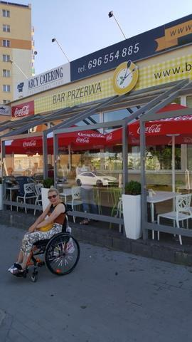
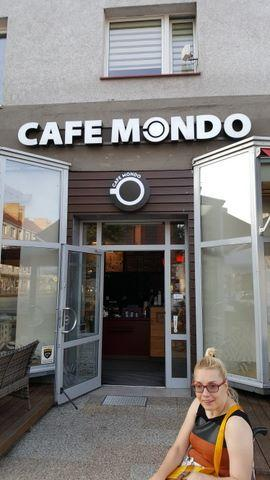
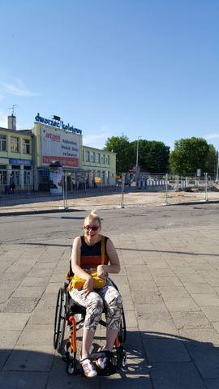

Dzisiejsza pogoda pozwoliła mi na degustację obiadu poza domem. W tym miejscu nie napiszę o KFC, czy o PIZZY HUT najpopularniejszych od jakiegoś czasu miejscach a o przyjemnie brzmiącej nazwie "PRZERWA", w którym jest podjazd dla wózków, WC dostępne dla wszystkich, menu wyśmienite tzn. wielkie porcje, niedrogo, a przede wszystkim bardzo smacznie.

Wiem o czym mówię - dzisiejsze naleśniki mają wiele wspólnego z pysznymi naleśnikami mojej babci. W karcie i na stołach lokalu różnorodność potraw, kilkanaście surówek, kompot bez ograniczeń. Bardzo miła i pomocna obsługa w lokalu. Byłam o 17-tej, klientów dużo, również dzieci, a jak wiadomo dzieciom trudno dogodzić. Dzielnica miasta może trochę zapomniana, ale mam wrażenie, że smakosze dobrej kuchni przywrócą do życia ul. Powstańców Wielkopolskich w Koszalinie. Polecam serdecznie przerwę na... pyszności. Warto posmakować

Dzisiaj zajechałam na nasz remontowany dworzec kolejowy. Chciałabym w tym sezonie pojechać do Mielna. Zobaczymy.
