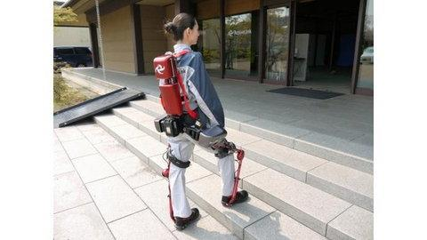
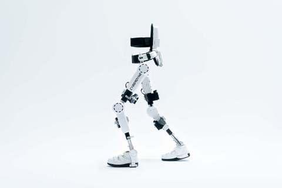

Dzisiaj poruszę temat, który już od jakieś czasu non-stop porusza moje myśli.

Egzoszkielet to urządzenie, które może pomóc w różnym stopniu osobom niepełnosprawnym w odzyskaniu najmniejszej sprawności, a nawet nowej samodzielności. Wygląda trochę kosmicznie, ale sama myśl popełnienia kilku samodzielnych kroków powoduje, że chcę ten szkielet ciężkiego kalibru poczuć na własnych plecach. Tym bardziej,że mój osobisty i bardzo kochany marszownik jest już trochę zmęczony.

Wśród moich znajomych są ludzie, którzy zapewne mają więcej informacji odnośnie tego "instrumentu" w praktycznym jego użyciu. Tu moja prośba, liczę na podpowiedzi i komentarze, które pomogą mi w zorganizowaniu próby.

Trafiłam na ciekawy felieton, w którym jego autor testuje egzoszkielet.

Dawid zaskoczył mnie trafnością przemyśleń, gdyby w pewnej chwili nie wyjawił, że jest zdrowy trwałabym w przekonaniu, że autor felietonu jest osobą niepełnosprawną.

W artykułach,znalazłam cząstkę swojej historii.