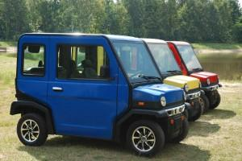
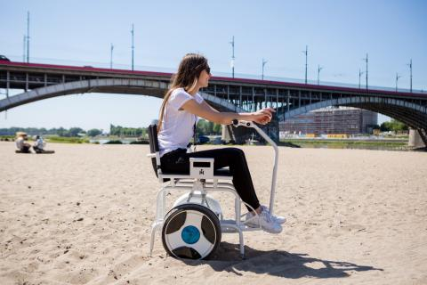
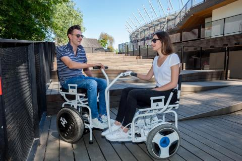
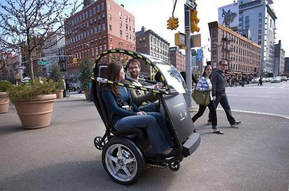

Wersja turystyczna, miejsce na bagaż. Lato, wakacje, podróż do Krakowa. Pięknie!

Pomału nadchodzi czas na zmianę mojego codziennego pojazdu. Wózek z napędem elektrycznym - tak uważam. Nie spodziewałam się, na rynku są dostępne naprawdę super "pojazdy".

Znalazłam wózek, który przy dużej motywacji i takim "fitnnesie" - jaki mam obecnie dam radę kiedyś sama poprowadzić. Chyba!

Przy okazji, drugie zdjęcie przedstawia bardzo praktyczną wersję schodów i podjazdu w jednym. Brawo dla pomysłodawcy.

Dostępne są również pojazdy dwuosobowe, gdyby moja starsza siostra nie nadążała za mną, wezmę ją na pakę.

Na razie to są moje pierwsze przemyślenia,decyzja zapadnie na jesieni, po mojej 35 imprezce urodzinowej (wpadnie trochę grosza, mam nadzieję). Uważam, że pojazd w wersji elektrycznej pozwoli mi poczuć się choć trochę osobą samodzielną.
