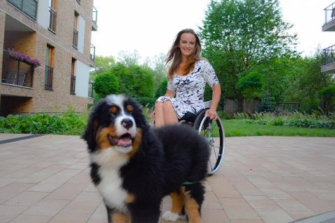
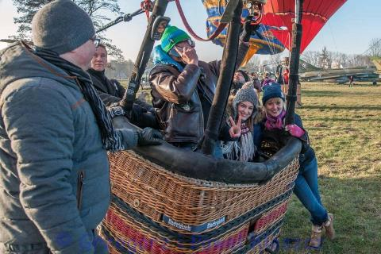

Dzisiaj trochę po koleżeńsku.

Nie wiem czy słyszeliście o pewnej dziewczynie, na którą kilka lat temu [spadł z siódmego piętra samobójca](https://www.newsweek.pl/polska/dziewczyna--na-ktora-spadl-samobojca,105841,1,1.html). Jego desperackie zachowanie skutecznie i całkowicie zmieniło Beacie dotychczasowe życie. Trudno uwierzyć w ironię losu, ale Beata z zawodu jest fizjoterapeutką. Po tamtych dramatycznych chwilach na dzisiaj sama potrzebuje profesjonalnej pomocy swoich kolegów. Jest typem kobiety sportowca, w obecnej sytuacji próbuje udowodnić , że jak się bardzo chce to można.

Walczy z wizerunkiem niesprawności podejmując extremalne próby. Jestem pełna podziwu dla niej i szczerze jej kibicuję. Jesteśmy do siebie trochę podobne, aczkolwiek sport u mnie był zawsze w dalekiej rezerwie. Nigdy nie podejmowałam zajęć ponad normę, może dlatego od długiego czasu nadrabiam stracone lata (mam na myśli swój ukochany fitness w domu). Moje rekordy życiowe od chwili narodzin po raz drugi, może nie są aż tak wyczerpujące fizycznie, ale popełniam swoje malutkie kroczki do przodu. Największym wyzwaniem stała się kontynuacja studiów. Kilka lat temu obrona tytułu licencjatu, w chwili obecnej przygotowuję sie do obrony pracy magisterskiej.

Kto by uwierzył? Nie chodzi, nie mówi, mieszka w Koszalinie a studiuje w Krakowie. Można? Można jak się bardzo pragnie. Wymarzony zawód dziennikarza dzisiaj dla mnie ma trochę inną wizję, ale powtórzę: nie mówi, nie chodzi a ma możliwość realizować swoje zawodowe plany.

Jakiś czas temu minęłyśmy się z Beatą w Bonarce, trochę za późno skojarzyłam. Nie znamy się osobiście, ale może kiedyś... jakiś wywiadzik?! Zobaczymy.

Beata Jalocha jest jedną z dziesięciu kandydatek Polski do **Miss Świata na wózku**. Głosowanie trwa do 18.08.2017r. Tu moja malutka prośba, zagłosujcie na dziewczynę, która dzięki swoim dokonaniom próbuje udowodnić również ludziom sprawnym, że mimo niepełnosprawności  można spełnić i zrealizować swoje marzenia i wytyczone cele. Sama już zagłosowałam. Trzymam mocno kciuki. Mam nadzieję, że przy naszym licznym wsparciu na szansę wygrać. Dwa lata temu została Vice Miss Polski.

[https://jedyna-taka.pl/miss,6,beata-jalocha.html](https://jedyna-taka.pl/miss,6,beata-jalocha.html)  
Aby oddać głos na kandydatkę nr **#6**  
wyślij **SMS** na numer **72068** o treści:  
**TC.JEDYNA.6**
