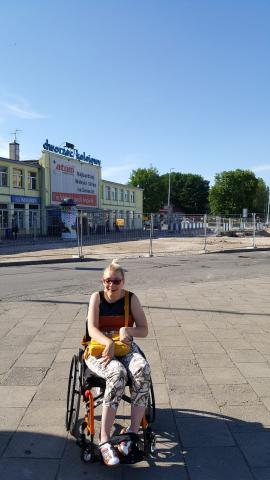
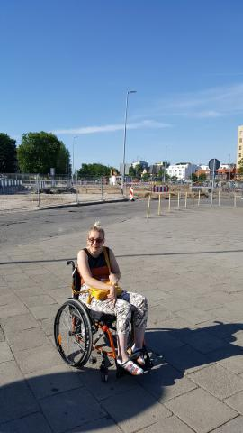
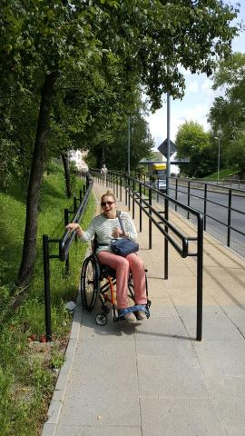
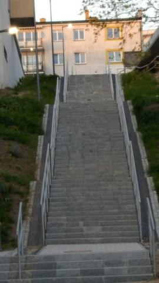
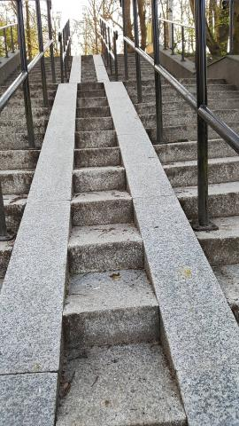

Plany były ambitne. Podróże podmiejską koleją do naszych nadmorskich kurortów. Niestety pogoda dała się wszystkim we znaki, szczególnie nam mieszkańcom północnej Polski. Słońca i ciepła jak na lekarstwo. Dodatkową barierą nie do przejechania pojazdem niezmechanizowanym, stały się  remonty głównych ulic naszego miasta. Stało się, może w następnym sezonie warunki dla ludzi niezmotoryzowanych będą bardziej korzystne.

Doczekałam się! Trwa modernizacja przejścia podziemnego, które ułatwi dostęp do budynku dworca PKP, wreszcie  dojazdu na same perony. Wygląda na to, że w tym roku goście  festiwalu „Integracja Ty  i Ja” będą mieli pod górkę w zwiedzaniu miasta. Trudno, ja też liczyłam na szybki koniec robót.

Mimo to, moje miasto pomału staje się przyjaznym dla ludzi mniej sprawnych, chociaż w dalszym ciągu realizuje sie projekty, które nie mieszczą się w żadnych standardach europejskich. Trochę na ostatnią chwilę, ale może uda się zrealizować rejs statkiem po Jamnie, jeziorze, które jest połączone kanałem z naszym morzem. Musi dopisać pogoda.
