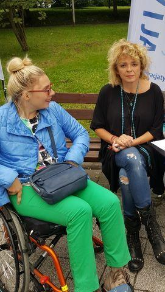
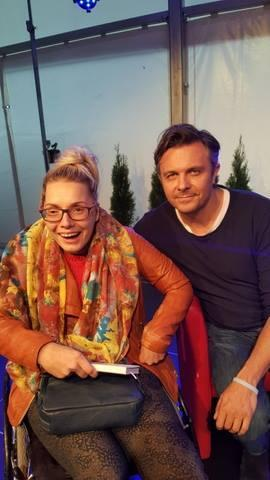
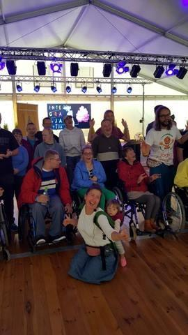
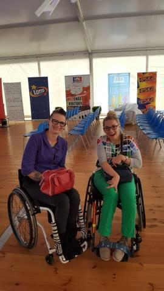

Wszystko co dobre, szybko sie kończy.

"Integracja Ty i Ja" - XIV europejski festiwal filmowy 5-9/09/2017 w Koszalinie przeszedł do historii. Festiwal filmowy moim zdaniem to skromne określenie.

Co tam sie działo?

Był to czas zawładnięcia dużej przestrzeni publicznej dla tematów dotyczących niepełnosprawności w kulturze i mediach. Była muzyka, teatr, fotografia, plastyka a także happeningi i performance. Spotkania i dyskusje bez granic z filmowcami oraz samymi bohaterami filmów, sportowcami.

Premierą była tzw. lasermania (elektroniczny painball), niestety nie dotarłam, ale w przyszłym roku nie odpuszczę. Drużyna osób z niepełnosprawnością "walczyła' z drużyną osób pełnosprawnych. Z przekazu zabawa była przednia.

Brałam udział w zajęciach Jogi Śmiechu, musicie mi uwierzyć, śmiech jest zaraźliwy i naprawdę rozluźnia. Savoir vivru wobec osób z niepełnosprawnościami, warsztaty w których brali udział  młodzi sprawni ludzie. Myślę, że wszystko zmierza w dobrym kierunku.

Wreszcie filmy. Kategorie trzy (amatorski, dokumentalny i fabularny), ale tak naprawę wartość artystyczna i temat często uniemożliwiały odróżnić film amatorski od dokumentu czy fabuły. Szczerze współczułam jury, ciężka decyzja kogo wyróżnić. Widzowie i tym razem nie zawiedli.Sala kinowa pękała w szwach. Doczekaliśmy się kartki na drzwiach **"Brak miejsc"**. Nie obejrzałam wszystkich filmów (od 9.00 do 22.00 przez pięć dni nie dałam rady). Moich faworytów nie było w finale, nie szkodzi, wszystkie filmy warto obejrzeć.
