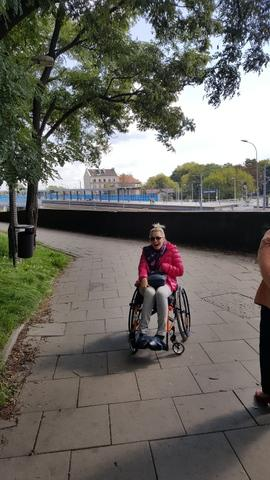
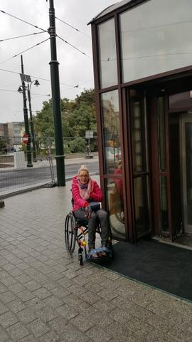

Obecnie pomieszkuję na Podgórzu, remonty ulic mają się ku końcowi. Efekty widać, mam ogromną chęć w przyszłości skorzystać z transportu szynowego. Z tego co widzę to Kraków Podgórze jest przygotowane dla podróżnych na dodatkowych kołach.

Mój dzisiejszy spacer po centrum Krakowa nie był łatwy. Przeprawa przez remontowane ulice przy dworcu kolejowym graniczyła z cudem.

Uff... udało się, ale tak naprawdę to przy okazji poruszę temat trochę zawstydzając włodarzy miasta. Do Krakowa przyjeżdżam regularnie dwa razy w roku od kilkunastu lat. Kiedyś ja, jak większość zdrowego społeczeństwa (tzn. do chwili wypadku), po prostu nie widziałam  windy na skrzyżowaniu ul.Lubicz i Westerplatte (a raczej, to co po niej pozostało), która na dzisiaj bardzo by ułatwiła nam - osobom na wózkach - dostęp do dworca PKP. Mam wielką nadzieję, że przy tak zwanej okazji, ktoś pomyśli o mniej sprawnych ludziach.

Ktoś kiedyś miał świetny plan, ktoś wykonał, tylko nie wiem czy komukolwiek udało się skorzystać z tej drogi na skróty.

Od wielu lat widok windy atrapy odstrasza, Galeria Krakowska wydaje się być blisko a tak naprawdę to jest daleko. Pod koniec paździerka przyjeżdżam na obronę pracy magisterskiej, zobaczymy.
