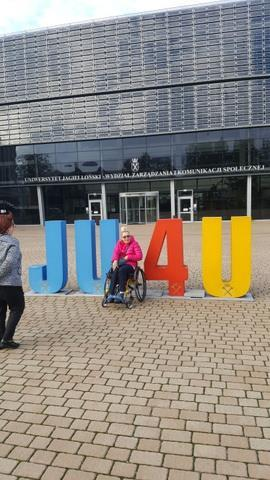
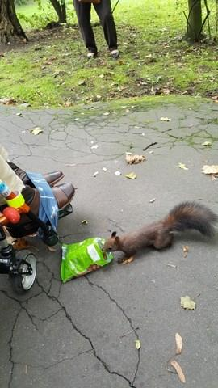
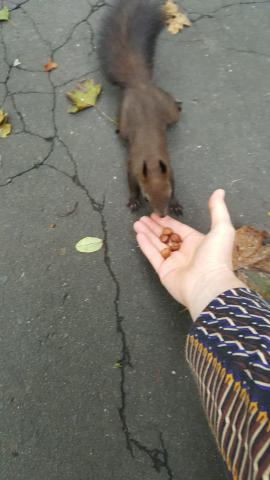
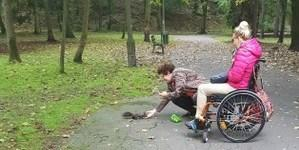
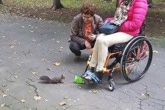

Czas mojego pobytu w Krakowie teraz dobiega już końca. Tym razem był  krótszy, ale jak bardzo ważny. Wreszcie złożyłam w dziekanacie moją pracę magisterską. Trwało to w sumie trochę długo, ale najważniejsze, zmieściłam sie w wyznaczonym czasie. Ta część planu wykonana, pozostała obrona pracy dyplomowej. Termin mam wyznaczony na 25.10.2017r. Trzymajcie za mnie kciuki, najlepiej już teraz.

Wczoraj znalazłam wolny popołudnowy czas aby ponownie odwiedzić śliczne Basie, lokatorki pobliskiego parku Bendarskiego.

W październiku zapewnię moim leśnym ślicznotkom dalszą część zimowego zapasu - bufetu.
