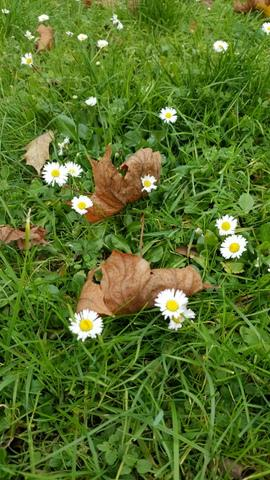
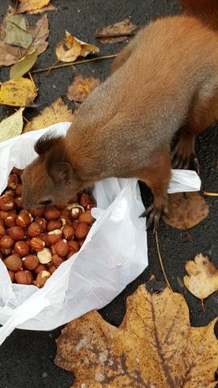
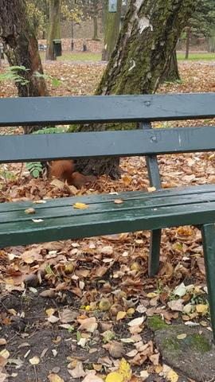
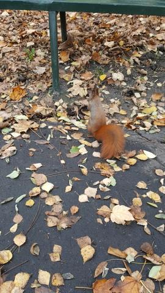
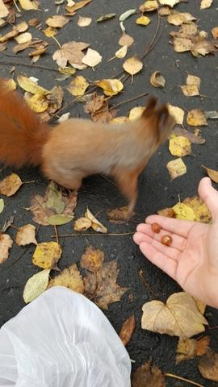
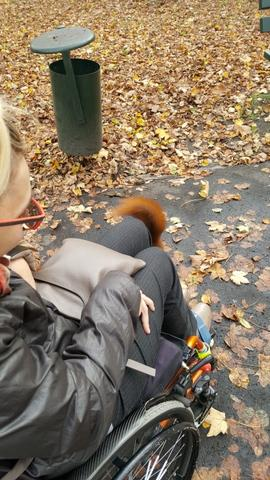
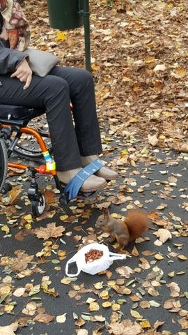
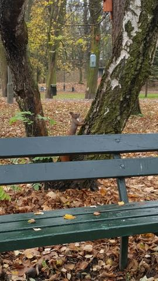

Ostatnie chwile w moim Krakowie (oczywiście w trakcie obecnego pobytu). Kolejna wizyta w przyszłym roku w czerwcu. Nie szkodzi doczekam się, czas szybko płynie.

Dzisiaj w pobliskim parku, odwiedziłam (jak zawsze) moje rude kumpele Baśki.

Pogoda zaskakuje nas wszystkich,piękne mamy lato tej jesieni,kwiatki kwitną.

Bufet zaopatrzony obficie nie sądziłam, że będzie mało, a jednak.

Wiewiórki są bardzo gospodarne, jeden orzeszek zjedzony, a następnych pięć na bieżąco chowanych w stercie liści.

To, że są śliczne wiemy już wszyscy, ale jakie spryciulne, nie zdążyłam upamiętnić foto jadłodajni Basi na moich kolanach, w ujęciu pozostała tylko ruda kitka.

Obok na ławeczce Basia nr.2 wskoczyła pewnej pani nie tyle na kolana co bezpośrednio do torby, zupełnie na luzie szukała tam smakołyków. Niestety mój fotoreporter nie był przygotowany.

W trakcie wizyty przekonałam się, że jest wielu miłośników tych uroczych malutkich zwierzątek. To dobrze.
