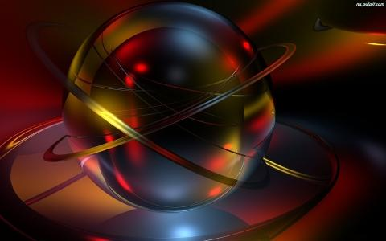
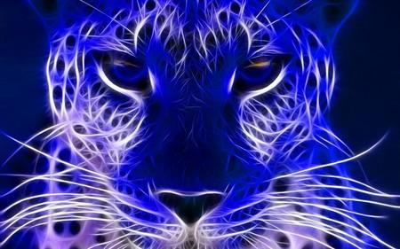
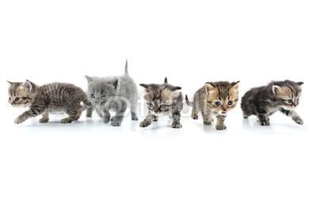

Polecam świetną książkę,”Piksele, wektory i inne stwory”. Treść lektury skierowana przede wszystkim do dzieci, ale spokojnie może służyć za pomocą każdemu przy pracy z komputerem. Poradnik, który pozwoli poznać tajniki grafiki komputerowej. Prosto i dostępnie przedstawiono podstawowe pojęcia dotyczace kolorów, rodzajów grafik, istotne uwagi dla pliku, który chcemy udostępić publicznie. Aplikacje i programy, (również bezpłatne) zawierają najbardziej potrzebne narzędzia.

Można korygować fotki, stosować różne fantastyczne efekty, zmieniać ustawienia obrazu, np. balans bieli, nasycenie kolorów lub kontrast. Mało tego można zaprojektować ulotkę, wizytówkę lub logo, przedstawiono konkretne, pełne przykłady, a każdy etap pracy został dokładnie opisany i zilustrowany, co pozwala na porównanie własnej pracy z omawianym materiałam. Nawet przy moich dużych ograniczeniach manualnych daję radę, dzieła wkrótce opublikuję. Naprawdę dobra zabawa, ale również rehabilitacja.

Pozbywamy się czerwonych oczu, zmarszczek i piegów i innych defektów. Wiemy jak zawrzeć na zdjęciu ozdóbki lub dodatkowy tekst, i wiele innych porad.

Zabawa i nauka dla całej rodzinki bez względu na wiek. Dla wielu może stać się udanym prezentem pod chionkę.
