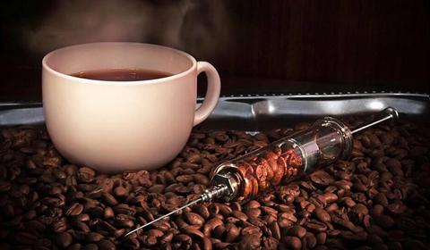
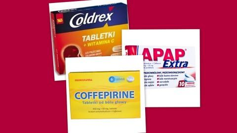

Kofeinizm czyli nałogowe spożywanie kofeiny. Za kofeinistę można uznać kogoś, kto spożywa dziennie ponad 750 mg kofeiny. Odpowiada to wypiciu 3 filiżanek kawy parzonej, 6 filiżanek rozpuszczalnej lub 6 czarnej herbaty. Nie znam nikogo, kto na własne życzenie rezygnuje z codziennego smakowania kawki.Kofeina mimo, że bardzo smaczna i skuteczna – dobrze poznałam to w okresie swoich studiów, okazuje się,że może być również zabójcza. Dwaj angielscy studenci wydziału sportu, brali udział w eksperymencie – jaki wpływ ma kofeina na nasz wysiłek fizyczny.Mężczyźni wskutek pomyłki (obliczeń naukowców prowadzących doświadczenie ) zamiast 300 mg otrzymali ponad 30g, czyli stukrotną -teoretycznie dawkę śmiertelną kofeiny.Przeżyli dzięki szybkkiej pomocy medycznej tj.zabiegom dializowania,które cofnęły na szczęście objawy zagrożenia życia.Po tym niebezpiecznym incydencie przez jakiś czas mieli kłopoty z pamięcią,obydwaj również sporo stracili na wadze.Sąd wydał wyrok dla władz uczelni o zapłatę odszkodowania na rzecz każdego z poszkodowanych po 500 000 dolarów. Ostatecznie sprawa zakończyła się na szczęście dobrze.

Nasuwa się pytanie: **mała czarna pić czy też nie pić?**

W nadmiarze czyni w naszym organizmie ogromne spustoszenia, jednak kilka filiżanek dziennie może uratować nam życie. Jak więc naprawdę jest z tą kawą?Media raczą nas na bieżąco informacjami o szkodliwości lub przeciwnie o pozytywnych jej właściwościach.

Dla nauki kofeina to alkaloidowy środek psychoaktywny, zaliczany do grupy stymulantów,czyli legalny narkotyk. Dopalacz.Substancja, która nas pobudza, stymuluje, aktywizuje, zwiększa koncentrację, dodaje energii. Jak inne substancje psychoaktywne uzależnia, jednak w znacznie mniejszym stopniu niż np. papierosy, alkohol czy twarde narkotyki. Kofeina bardzo skutecznie uwrażliwia receptory dopaminowe, które odpowiedzialne są za polepszenie nastroju, koncentracji i odczucie euforii, przez co spożywanie dużych jej dawek sprawia, iż organizm „potrzebuje” codziennej dawki energii w postaci dostarczanej z zewnątrz.

Jednak zawarte w kawie przeciwutleniacze chronią w jakimś stopniu naczynia krwionośne mózgu przed szkodliwym wpływem złego cholesterolu, który może spowodować powstawanie blokujących naczynia skrzepów. Mało tego,małe dawki kawy nie tylko sercu nie szkodzą, ale nawet poprawiają jego kondycję. W dodatku picie kawy (koniecznie z kofeiną) może mocno ograniczyć ryzyko wystąpienia depresji u pań. Kawa obniża u chorych na WZW typu c poziom enzymów wątrobowych, spowalnia postęp choroby i minimalizuje ryzyko wystąpienia nowotworu. Inne badania dowodzą też, że picie kawy zmniejsza ryzyko wystąpienia marskości wątroby.  Po wypiciu wieczornej kawy dla potrzeb np.nauki nie śpimy. Większość kawoszy wie po sobie,że kawa poprawia pamięć krótkotrwałą i zdolności poznawcze,jednak czasmi dziwnie wywołuje rozdrażnienie i uczucie niepokoju.

**Pić czy nie pić?**  
Czy warto ją pić, każdy z nas powinien zdecydować sam (na podstawie reakcji organizmu), Jedno jest pewne. Nie należy przesadzać,zresztą jak ze wszystkim.Trzy filiżanki kawy dziennie z pewnością wystarczą, by wykorzystać jej dobroczynne właściwości i poprawić nastrój,dla mnie jest to dawka akurat.Nadmiar może sprawić, że kawa przestanie być przyjacielem naszego organizmu: przewlekłe zmęczenie, a ustępujące po spożyciu kofeiny, ból głowy lub otępienie i apatia powinny przemawiać za zmniejszeniem dawki przyjmowanej kofeiny, ale stopniowo, do czasu aż będziemy w stanie opanować niepożądane efekty uboczne.

Kofeinę znajdziemy także w innych produktach spożywczych, np. czarnej herbacie czy czekoladzie, napojach energetycznych i wielu tabletkach przeciwbólowych. Sięgając po kolejną małą czarną , miejmy świadomość,że prawdopodobnie dostarczyliśmy już organizmowi kofeiny pochodzącej z innych źródeł a wszystko będzie dobrze. Warto rozłożyć sobie dawki kofeiny na mniejsze i spożywać je częściej, pozytywnie na nas działa, niwelując uczucie zmęczenia, poprawia koncentrację, funkcjonowanie serca i układu trawiennego, a także polepsza metabolizm.
