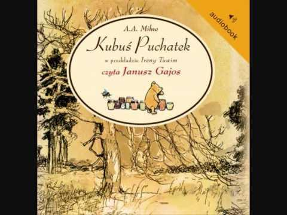

Nie wiem jak tam u was z czytaniem książek, ja ostatnio wróciłam do formy audiobook'ow. Kilka lat temu,gdy po swoim wypadku powróciłam na studia, wszelkie pomoce nagrane na audio ułatwiały mi naukę. Moim mistrzem przetwarzania wiedzy z druku na dźwięk był kolega Jurek, człowiek niewidzący, który miał odpowiedni program komputerowy. Audiobooki początkowo miały służyć przede wszystkim osobom niewidzącym.Pomysł stworzenia pierwszej „mówiącej książki elektronicznej ”powstał dosyć dawno. Tomasz Edison, wynalazca fonografu, jeszcze w XIX wieku, stworzył urządzenie, którego przeznaczeniem było na mówienie do osób niedowidzących, bez wysiłku z ich strony”.Dzisiaj książka czytana może służyć każdemu, kto tylko znalazł przede wszystkim przyjemność w jej słuchaniu,ponadto podobnie jak ja ma ograniczenia, które nie pozwalają na czytanie tradycyjnej książki.

Przywołują mi kochane chwile z dzieciństwa,kiedy wieczorem babcia lub mama czytały mi na dobranoc.Obecnie czytam/słucham książki pt.”Ania” o nieżyjącej Ani Przybylskiej,która była moją idolką.Wspomnienia wielu dobrych znajomych bohaterki książki czyta jej przyjaciółka Anna Dereszowska.Lektura,która jest dla mnie super lekiem na wieczorną gonitwę myśli. Fajną sprawą jest to,że audiobooka może stworzyć właściwie każdy – jeśli oczywiście wygasły już prawa autorskie do danego utworu (lub mamy zgodę autora, a przy książkach obcojęzycznych tłumacza).

Trafiłam na strony internetowe,które udostępniają audiobooki bezpłatnie,zapewne jest ich wiele.

Na anglojęzycznej stronie Librivox.org po wybraniu opcji „Listen catalog”, „Language” i „Polish” uzyskamy dostęp do 43 pozycji książkowych w naszym ojczystym języku.

Wolnelektury.pl ,znajduje się tu kilka tysięcy wierszy, przypowiastek i powieści, które można bez problemu odtwarzać.

Doba komputerów i internetu otwiera nam bibliotekę całego świata.
