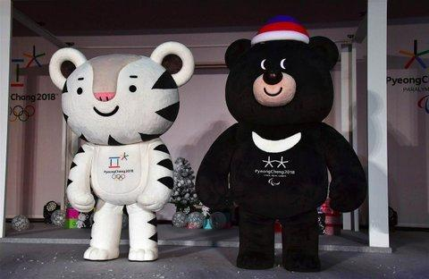
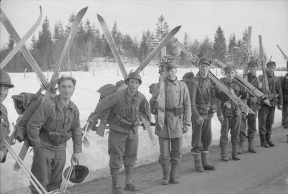
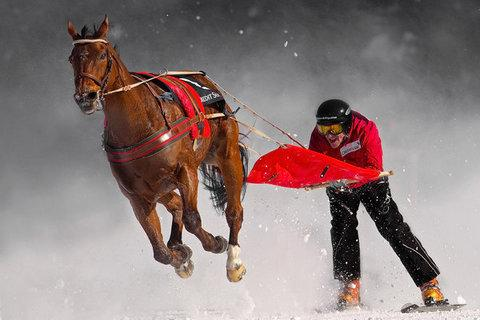
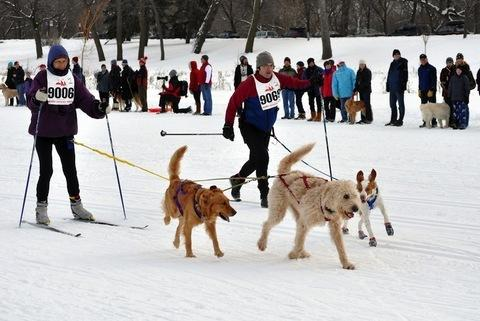
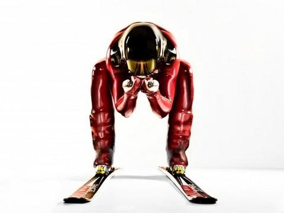
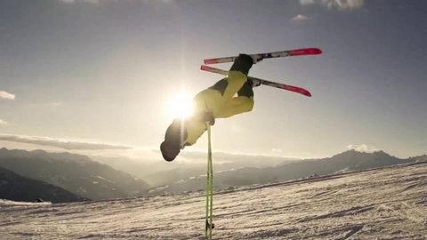
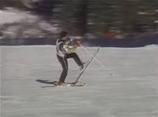
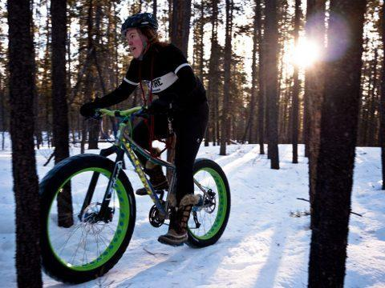
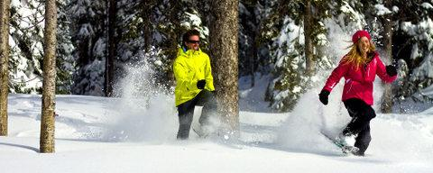

Za kilka dni czekają nas sportowe emocje. Igrzyska olimpijskie XXII w historii sportów zimowych tym razem zorganizowane w Korei Południowej. Znalazłam kilka zaskakujących, ciekawych i śmiesznych informacji związanych ze sportem uprawianym w śnieżnej bieli. Pierwowzorem biathlonu,dyscypliny sportu,która łączy biegi narciarskie ze strzelectwem. były w latach 1924-1948 pokazy patroli wojskowych.

Występujący żołnierze zniekształcali wizerunek igrzysk jako imprezy pokojowej.

Jest widoczna pewna zależność w organizacji tego typu imprez.Gospodarz – organizator olimpiady ma możliwość pokazania swojej narodowej konkurencji.

Skijöring: nazwa dyscypliny pochodzi z języka norweskiego, połączenia słów ski – narty oraz kjöre – powozić. Ta zimowa dyscyplina polega na wyścigu narciarzy ciągniętych przez zwierzęta: psy lub konie albo współcześnie skuter śnieżny a nawet samochody.W Skandynawii i Kanadzie do dzisiaj zapewnia świetną zabawę.

Bandy jest sportem zespołowym podobnym do hokeja, wywodzącym się ze średniowiecznej niderlandzkiej zimowej gry. W sumie wszystko tutaj wygląda jak w hokeju. Zawodnicy jeżdżąc po lodowisku na łyżwach uderzają w piłkę za pomocą zakrzywionych kijów.  

Tragedią zakończyły się próby wpisania narciarstwa szybkiego,jako konkurencji olimpijskiej Kiedy podczas treningu zginął jeden z zawodników, uznano tę dyscyplinę za niebezpieczną i wycofano ją z programu.  

Kilkuletnią historę w karty zimowych igrzysk zapisał balet narciarski.Twierdzę,że jego powrót dałby szansę wielu biegaczom czy skoczkom narciarskim kontynuować karierę sportową , trochę w innej wersji. Każdy z nas byłby ciekaw występu naszej Justyny czy Adama.Widowiskową konkurencją wydaje się być big air.Snowboardzista najeżdża na skocznię, a następnie w powietrzu wykonuje trik. Sędziowie oceniają m.in. stopień jego trudności, jakość wykonania i czystość lądowania.Kolejną dyscypliną jest wyścig ze startu wspólnego w łyżwiarstwie szybkim , w którym występuje 24 zawodników .Następna to curling, w której od roku 2018 wprowadza się pary mieszane.Zastanawia mnie czy kamienie,które są składową konkurencji są aż tak drogocenne i trudno dostępne,że do dzisiaj nie mamy polskich reprezentatów.

Do bram olimpijskich dobija się fat biking, czyli jeżdżenie po śniegu na rowerze o specjalnie grubych oponach. Gratka nie tylko dla zawodowców! Rower ten przystosowany jest do jazdy nawet w najtrudniejszych warunkach. W Polsce nie jest jeszcze zbyt popularny, ale za granicą w wielu miejscach można go wypożyczyć.Bardzo mi się podoba ten pojazd,może w niedalekiej przyszłości zwiększy nam wózkowiczom możliwości poruszania się w zimowej scenerii.

  
Snowshoeing : mamy erę miłośników biegania i okazuje się,że sterty śniegu nie są w stanie ich powstrzymać.Biegacze zakładają na nogi rakiety śnieżne i biegną przez zaspy.  
Porównując obydwie olimpiady -letnią i zimową pod względem konkurencji,zdecydowanie wybieram tę drugą,jako bardziej widowiskową. Rywalizacja między zawodnikami wydaje się być rzeczowa,jednak często wrażenia wizualne dla publiczości głęboko zabawne.Kojarzą się bardziej z zabawą niż ciężko wykonywanym rzemiosłem sportowym.Tutaj też widzę w przyszłości,wiele wspólnych zintegrowanych występów sportowców sprawnych z mniej sprawnymi.
