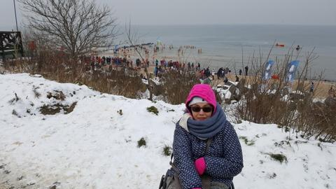
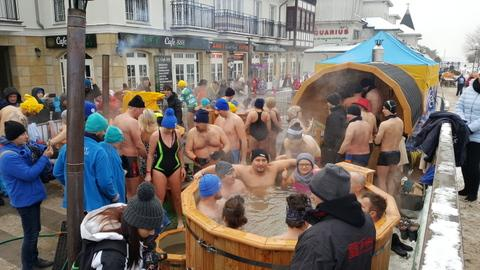
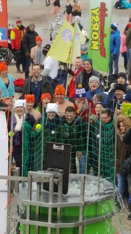
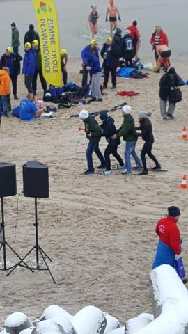
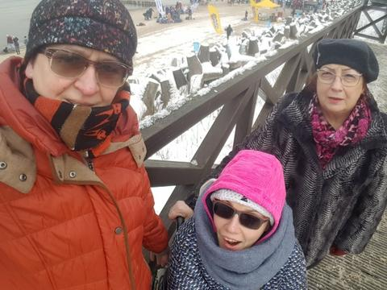
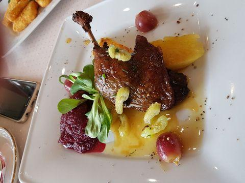
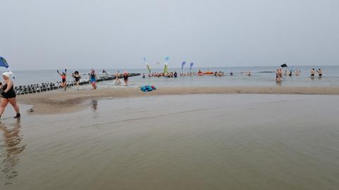
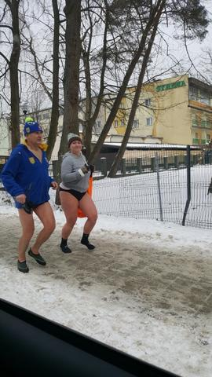

Ostatni weekend spędziłam w Mielnie,z trzech istotnych powodów.Po pierwsze odbywał się tam kolejny Międzynarodowy Zlot Morsów.Chciałam osobiście zobaczyć maniaków zimowych kąpieli,na samą myśl czułam zimno wszędzie.

Okazuje się,że wspólne kąpiele odbywają się co tydzień przy okazji doskonałej motywacji i zabawy.

Ludzie morsy nie chorują,usłyszałam w rozmowie z uczestnikami.  
Dowiedziałam się również ,że słone zimne kapiele skutecznie rozluźniają spastykę,a ona ” towarzyszy „mi od wielu lat.Chwilowo nie jestem w stanie w ogóle sobie wyobrazić siebie jako morsa, jednak kto wie czy po konsultacjach specjalistycznych (gdyby się okazało ,że mogę),nie podejdę do próby.

Drugim powodem mojej wizyty w Mielnie była obecność wolontariuszy akcji „Wrzuć piątaka na karetkę dla wcześniaka”.Akcja trwa już jakiś czas,chciałam osobiście wrzucić kilka piątek również w imieniu przyjaciół,którzy nie mogli tego zrobić.

Trzecim punktem programu w tym dniu była trochę spóźniona moja imieninowa imprezka,której finał odbył się podczas smakowitej biesiady w restauracji przy plaży.

Nie wiem jaka zapadnie decyzja w sprawie mojego morsowania,ale chciałabym a boję się,u hu ha,u hu ha...
