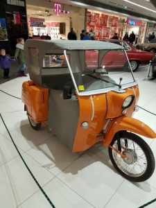
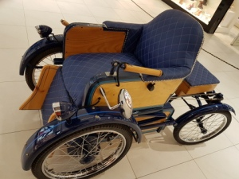

Mam nadzieję, że moje milczenie na antybarierze minęło na zawsze. Okazało się, że stan techniczny mojego bloga był w opłakanym stanie, wskutek czego całkowicie został zablokowany przez operatora sieci. Przepraszam!  
Teraz wszystko w jest w porządku, zawdzięczam to moim serdecznym przyjaciołom z bliska i daleka. Korzystam z okazji i bardzo bardzo dziękuję Agacie Z. oraz [Dariuszowi W.](https://dariusz.wieckiewicz.org)

Kilka dni temu, gdy wreszcie pogoda pozwoliła mi wyjść, czysty przypadek sprawił, że udałam się na wystawę pojazdów retro m.in. wózków inwalidzkich. Chętnie bym wykonała jazdę próbną, ale niestety nie wolno było nawet dotknąć eksponatów. Okazuje się, że już w roku 500 p.n.e.w Chinach i Grecji pomyślano o ludziach, którzy nie mogli samodzielnie się poruszać.

Kolejny zapis w historii wózków inwalidzkich to rok 1595. Hiszpański król Filip II jeździł na czymś w rodzaju fotelu z kołami. Rok 1885 był przełomem, brytyjski naukowiec wynalazł obręcze metalowe przyczepiane do kół wózka, od tego momentu pojazdy mogły już prowadzić samodzielnie osoby niepełnosprawne.  
W 1900 roku skonstruowano wózek inwalidzki napędzany ręcznie przy pomocy łańcuchowej przekładni. Składane wózki pojawiły się w roku 1932.

Przez następne lata dosyć szybko modernizowano pojazdy dla osób niepełnosprawnych. Dzisiaj z napędem elektrycznym, lekkie, zwrotne, również składane, a najważniejsze dają możliwość sterowania osobom  
z ciężkimi urazami, z małą samodzielnością palcem lub wzrokiem. Samo życie zachęciło użytkowników do indywidualnych „poprawek” wózków inwalidzkich. Dzięki temu współcześnie nie ma barier w przemieszczaniu się osobom z niepełnosprawnościami. Możemy uczyć się, pracować czy uprawiać sport poza domem, czyli brać czynny udział w życiu społecznym.
