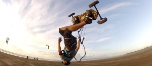

Pogoda w ostatnich dniach pozwoliła mi inspekcję etapu prac remontowych mojej kamienicy. Dom (na zdjęciu w tle za mną) prezentuje się całkiem przyzwoicie, jednak dla mnie najważniejszy był chodnik, który obecnie jest już wypoziomowany na równi z wyjazdem z klatki schodowej. Pozwoli to na bezkolizyjne używanie mojego wózka elektrycznego. Do tej pory wózek trzeba było przenosić przez próg, teraz mam dostępny przejazd. Mknie jak Suzuki po autostradzie, jednak warunkiem jest w miarę równy teren. Bardzo intensywnie trwają również prace nad ścieżką rowerową biegnąca wzdłuż obrzeży Koszalina tzw. Szlak Bałtycki. Przy dobrych "wiatrach" na trójce w moim wypasionym nowym wózku spokojnie dojadę do np. Mielna. Gosia chcąc mi dotrzymać kroku będzie musiała do butów przykręcić kółka lub zainstalować coś w rodzaju hulajnogi.

