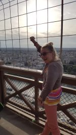
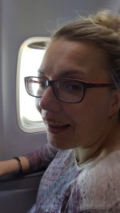
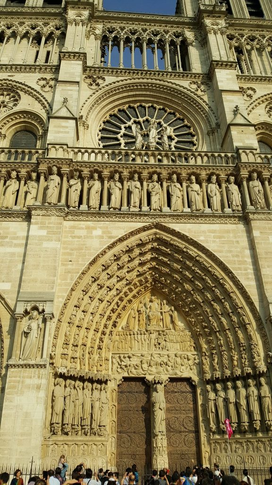
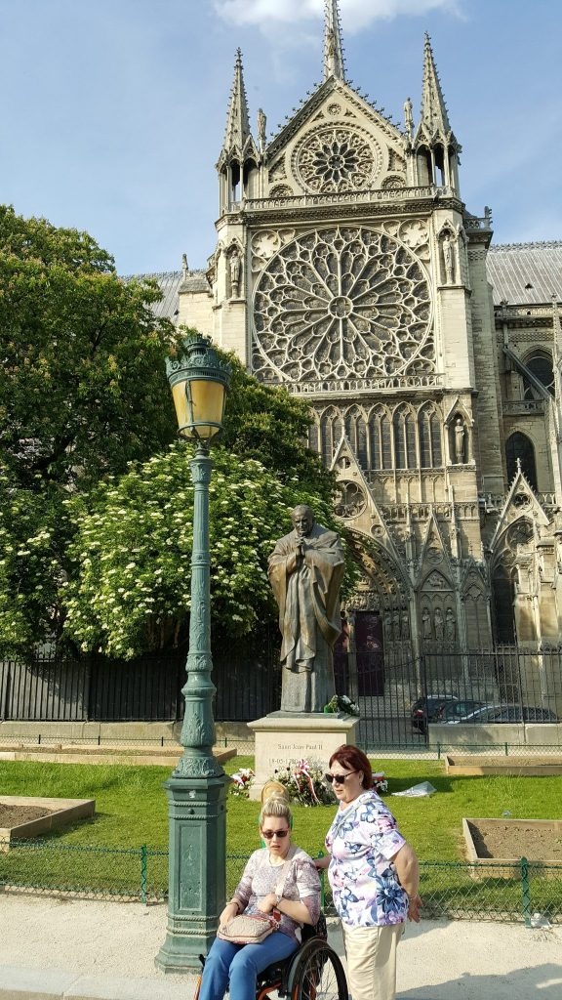

Niemożliwe stało się prawdziwe, byłam w Paryżu. Ktoś może powiedzieć, że nie da się przez cztery dni zwiedzić tej metropolii, ale nie z moją kuzynką Margot. Dziewczyna spisała się na medal, zobaczyłam prawie wszystko co chciałam. Planowałam relacje na bieżąco, jednak okazało się, że doba za krótka i nie dałam rady. Mam nadzieję, że mój obecny wpis w kilku odcinkach ze zdjęciami po części oddadzą fenomen tej niezwykłej podróży. Zacznę od początku.

**Podróż.  
**Ucieszyłam się, że na lotnisku, w przysłowiowych drzwiach czekał na mnie asystent, dzięki któremu odprawa i inne czynności przebiegły bardzo sprawnie. Specjalistycznym wózkiem przewieziono mnie na miejsce w samolocie.  Przeleciało nie wiedzieć kiedy, na lotnisku w Paryżu czekała na mnie moja perfekcyjna przewodniczka tj. Margot. Krótki wypoczynek w hotelu pozwolił na realizację pierwszego punktu planu tj. Bazyliki Notre Dame. W tym miejscu poruszę transport publiczny, podobno dostępny dla osób z niepełnosprawnością Owszem jest linia metra, która ma na swoich stacjach windy, jednak często są popsute. Poza tym złe oznakowania zmuszają do poszukiwań wind na dużej przestrzeni danej stacji. Dałyśmy radę.

https://youtu.be/-AR34eGQfxs

Bazylika Notre Dame, całe mnóstwo wspomnień.

Drugi odcinek już wkrótce.
