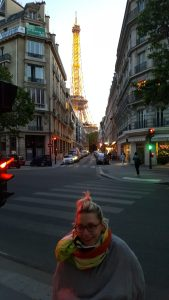
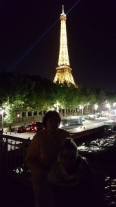
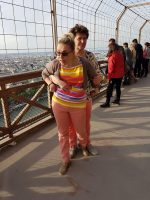
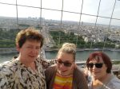
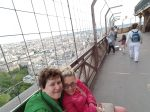

Uwieńczeniem wieczornego spaceru w tym dniu była wyprawa na wieżę Eiffla. Udogodnienia dla wózkowiczów zaczynają być zwyczajowe,w ięc bez większych przeszkód znalazłyśmy się przy windzie wieży.  
  
Na moim wózku dojadę jedynie do drugiego poziomu widokowego - względy bezpieczeństwa. Okazało się jak bardzo ważne w tym dniu, na żaden poziom widokowy nie wjechałam. W drzwiach windy usłyszałyśmy STOP i natychmiastową ewakuację poza zwiedzany teren. Do dzisiaj nie wiem jaki był powód ewakuacji, jednak jestem pełna podziwu dla organizatorów oraz zwiedzających.Wszyscy w uporządkowanym szyku, prawie marszowym krokiem kierowali się do wyjścia. Uderzał spokój i niesamowita cisza, napięcie puściło dopiero po drugiej stronie Sekwany. Pod dużym znakiem zapytania stała ponowna próba "zdobycia" przez nas tego atrakcyjnego obiektu. Ciekawość wrażeń zwyciężyła. W dniu następnym, z duszą na ramieniu (niepotrzebnie) wjechałam na dozwolony poziom. Powiem albo raczej pokażę na zdjęciach, warto było. Zobaczyłam przepiękną panorama miasta, dzięki mojej kuzynce Margot. Następne dni również zapewniły mi wiele emocji, ale o tym wkrótce.                                                                                      

