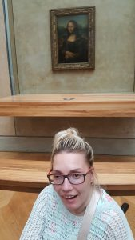
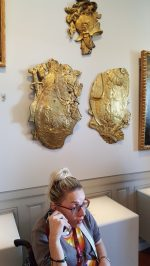
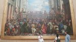
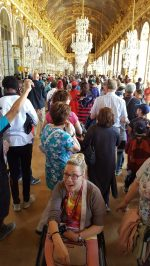
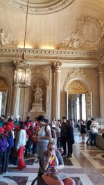
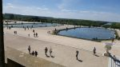
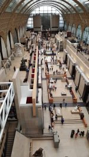
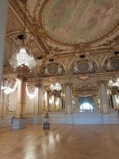
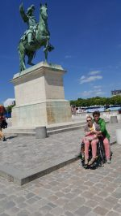
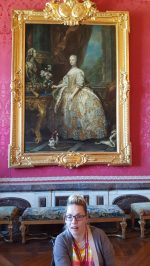

Luwr, Wersal oraz Muzeum Orsay, takie były plany i ku wielkiemu zaskoczeniu  dałyśmy radę. Cieszy fakt dostępności do obiektów (zabytków) osobom z niepełnosprawnością.

Ciekawym i praktycznym rozwiązaniem był przewodnik nagrany (nawet w języku  polskim) w telefonie komórkowym. Dało to możliwość samodzielnego zwiedzania, a i tak nie sposób było to wszystko zapamiętać. Dopiero w domu oglądając zdjęcia, uświadomiłam sobie, że dokonałyśmy prawie niemożliwego. Dziękuję Margot, bez której mój pobyt w Paryżu ograniczyłby się  jedynie do wypadów w pobliżu hotelu. Wrócę jeszcze na chwilę do ważnej nie tylko dla mnie kwestii. Okazuje się, że Francja kilkanaście lat temu podpisała deklarację o całkowitym dostępie miejsc publicznych dla osób z niepełnosprawnością. Miałam okazję przekonać się co do spełniania tych zapisów przez rząd francuski, są realizowane. W Polsce natomiast podpisana jest (smutne ale prawdziwe) tzw. częściowa deklaracja, którą sama mam konieczność odczuwać codziennie. Może kiedyś o tym opowiem.

         
Dobrze, że jestem na fotkach, bo jeszcze mi trudno uwierzyć. Niestety, ale będzie jeden wpis, nie mieszczę się w ramkach.
