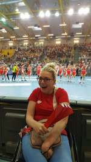
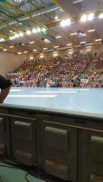
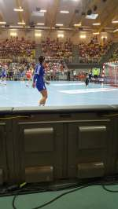

W koszalińskiej hali widowiskowo-sportowej odbyło nie lada ważne wydarzenie, eliminacje do Mistrzostw Europy w piłce ręcznej pań. Cieszy mnie fakt, że Koszalin coraz częściej organizuje światowe imprezy. Grałyśmy ze Słowacją, przez godzinę przy olbrzymim dopingu publiczności nasze szczypiornistki grały mistrzowsko, zdecydowanie wygrały. Pierwszy raz miałam okazję uczestniczyć w imprezie sportowej na żywo. Niezapomniane emocje, trudno jest siedzieć cicho,klimat panujący w hali zawładnął i mną.

Jak wiadomo nie przepadam za sportem, kibicuję jedynie naszej kadrze narodowej w różnych dyscyplinach ale w zaciszu domowym. Nie ma porównania i dlatego jak tylko nadarzy się okazja postaram się kibicować bezpośrednio. Podczas trwania Mistrzostw Świata w piłce nożnej będę w Krakowie,może jakaś strefa kibica. Ha,ha, zobaczymy.

