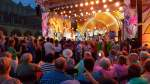

Mój pobyt w Krakowie zawsze ograniczał się do konkretnych miesięcy związanych ze studiami - wiosną i jesienią. Czerwiec jest miesiącem kiedy mogę zobaczyć wiele miejsc i uczestniczyć w imprezach. Zależało mi na wczorajszym  finałowym koncercie Festiwalu Zaczarowanej Piosenki. Odbywał się na Rynku Głównym  w Krakowie.

    
Początek bardzo sympatyczny, niestety w miarę upływu czasu niemiłą niespodzianką uraczyła nas pogoda. W chwili rozpoczęcia gali intensywny deszcz i burza po prostu przegoniły z widowni nie tylko mnie. Kolejne zaskoczenie czekało nas na przystanku tramwajowym, który był nieczynny. Taksówki sieciowe niedostępne, nadal leje i grzmi, robi się ciemno, a do domu daleko. Czekał nas długi spacer pod natryskiem z nieba. Wybawieniem dla nas okazał się życzliwy kierowca taksówki stojącej po prostu na postoju. Bezpiecznie dotarłyśmy do domu. Dziękujemy za pomoc.
