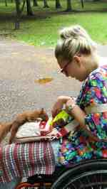
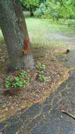
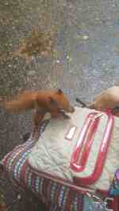
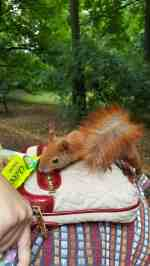
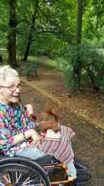
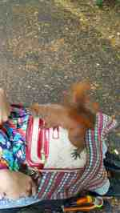
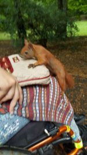

Po wczorajszej burzy dzisiejsza pogoda zapowiadała się podobnie. Jednak stało się inaczej, trochę chłodniej, ale za to idealnie na spacer i odwiedziny moich starych, dobrych znajomych. Rudych Basiek - wiewiórek, zamieszkujących pobliski park. Pora była obiadowa i dlatego pewnie na zwyczajowe nawoływanie tj. stukanie orzeszkiem w korę drzewa, natychmiast pojawiły się nie wiadomo skąd cztery.

 Jedna z nich była pięknie brązowa, jak gorzka czekolada.Po zachowaniu ich, było widać, że są oswojone i bardzo głodne. Najpierw próbowały się dostać do mojego plecaka, jednak bufet smakołyków był otwarty na moich kolanach. Ciekawym zjawiskiem jest zachowanie tych małych zwierzątek, nikt ich przecież nie uczył, a wiedzą jak zdobyć pożywienie od człowieka.

  
Jeden orzeszek został skonsumowany na miejscu, następny zakopany w liściach. Zjadły wszystko co przyniosłam, poszukiwania w torebce, pod torebką, pod bluzką itd. nie dały skutku. Dzisiaj bufet zamknęłam, ale jeszcze nie raz powrócę do moich ślicznotek.

