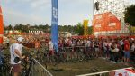
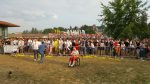
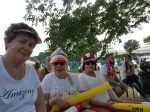

 Wiele czynników złożyło się na moją obecność w strefie kibica. Dobra pogoda i możliwość długiego spaceru po Krakowie w miejscach mniej mi znanych oraz szansa wspólnego przeżywania meczu z dużą grupą kibiców. Wstyd się przyznać, ale sport w moim życiu ulokowany był na ostatnim miejscu listy zainteresowań. Mistrzostwa Świata w piłce nożnej w Rosji oglądane na olbrzymim ekranie w strefie kibica zmieniły moje spojrzenie. Po raz pierwszy uczestniczę w tego rodzaju imprezie i powiem krótko: bardzo mi się podobało. Największy telewizor w salonie domowym nie odda klimatu panującego w strefie kibica.  
  
Wspólne śpiewy, głośne skandowanie, dzielenie się smutkiem lub radością stworzyły niezapomniane chwile. Na piłce nożnej kompletnie się nie znam, mecz z Senegalem przegraliśmy bo moim zdaniem przeciwnik był przebiegły i szybki. Trudno, ale już za kilka dni czekają nas kolejne przeżycia związane z Mundialem. Jeśli tylko warunki pozwolą jadę obejrzeć kolejny mecz i kibicować naszej drużynie.

Wszystkim polecam podobnie tym bardziej, że nasi piłkarze potrzebują jeszcze większego wsparcia. Organizacja widowiska z udziałem wózkowiczów pozostawiała wiele do życzenia, ale wrażenia niwelowały wszelkie niedogodności.

**Polska biało-czerwona niezwyciężona**
