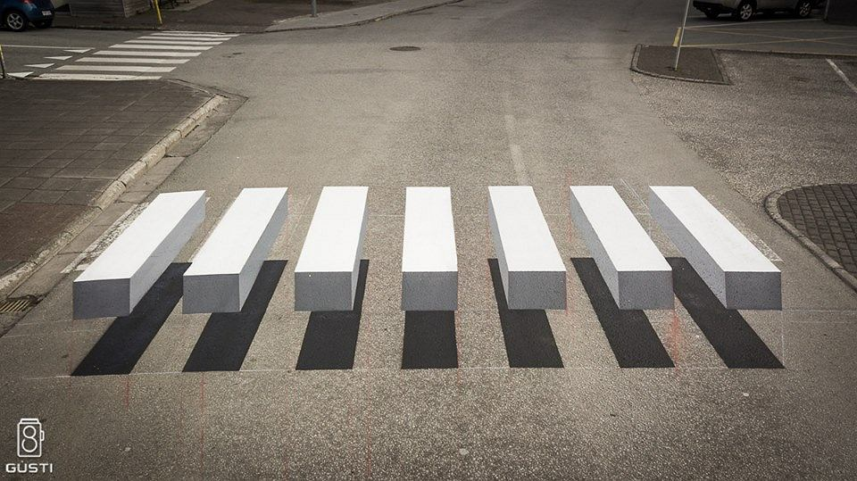
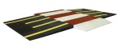

  
Dzisiaj możliwości techniki ale i pomysłowość zdolnych ludzi nie ma granic. Coraz bardziej popularne (na bezpieczeństwo i życie każdego z nas) stają się na naszych ulicach dosyć oryginalne przejścia dla pieszych.  
Zwyczajna "zebra" dzisiaj w innym, nowym kolorowym wymiarze, zmusza każdego kierowcę do zwolnienia jazdy.  
Tzw. "kocie oczy" - światełka zamontowane na jezdni wzdłuż pasów dla pieszych, które zapalają się w chwili wejścia pieszego na pasy.  
  
Spowalniacze i przejście dla pieszych w jednym, albo antypoślizgowe nawierzchnie ulic przy pasach dla pieszych, też wydają się być skutecznym sposobem na uniknięcie wypadku. Mi osobiście, innowacje na jezdniach podobają się, dają poczucie bezpieczeństwa,mam nadzieję,że staną się stałym punktem użytkowania dla wszystkich. Obecnie są w testowane w kilku miastach Polski, w Gdańsku, czy w Krakowie i Europy, jak np. w Paryżu. Jednak, nic jednak nie zastąpi rozwagi i ostrożności każdego użytkownika dróg publicznych.

