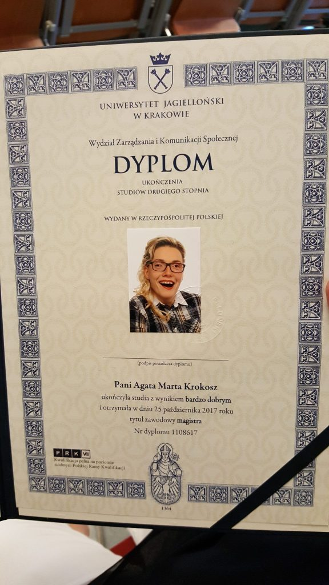
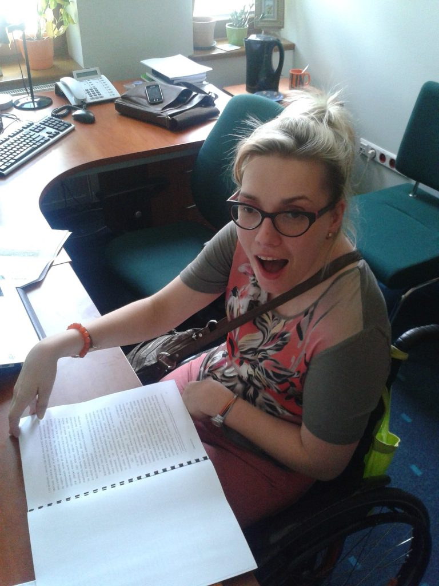
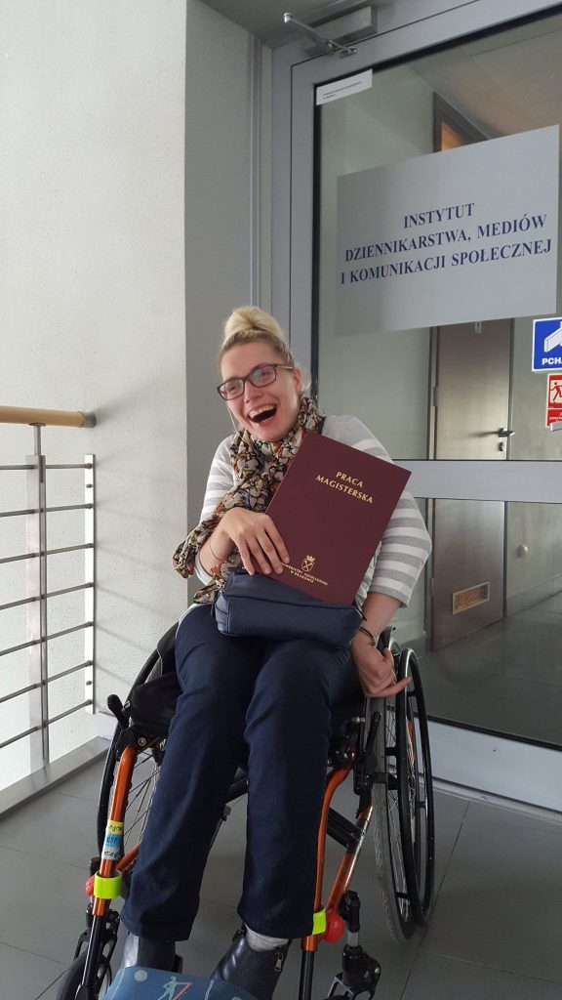
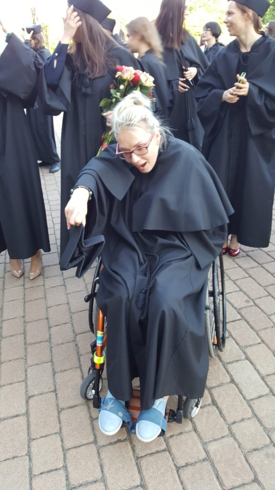
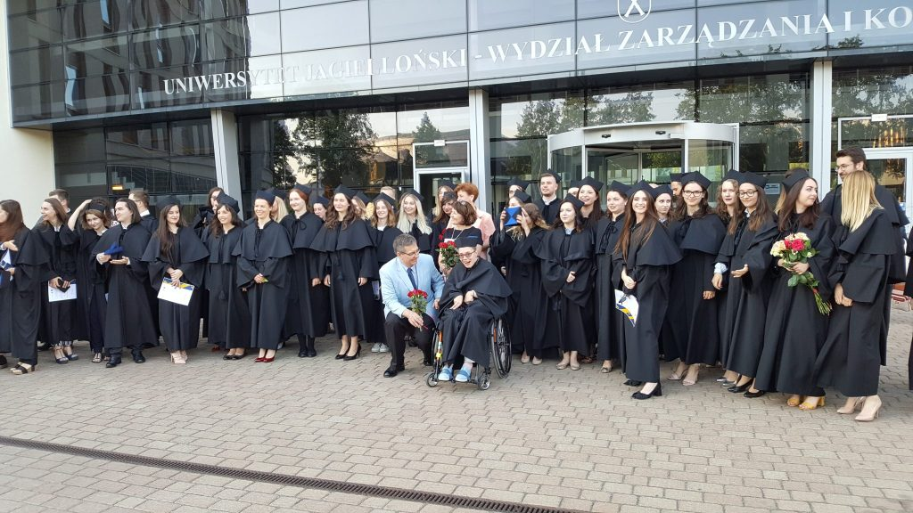
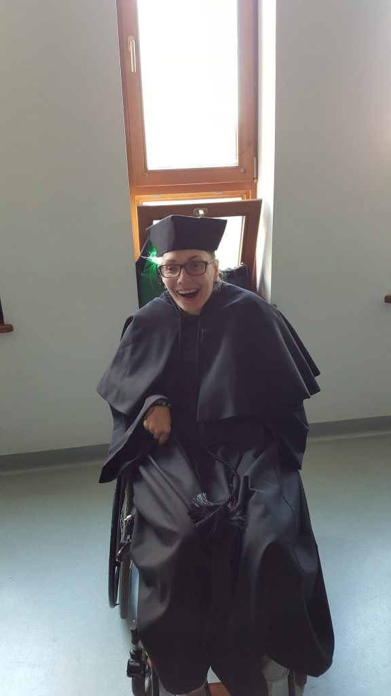

    

    

  
Do drzwi puka nowy rok szkolny 2018/2019. Poruszę wielki problem jakim jest nowe rozporządzenie obecnej minister edukacji. Dzieci z niepełnosprawnością nie będą miały możliwości nauczania indywidualnego w szkołach. Rozumiem, że zgodnie z tym zapisem kończy się integracja w placówkach edukacyjnych. W tym miejscu skupiam na odpowiedzi kto decyduje, które z dzieci niesprawnych może się uczyć z osobami sprawnymi? Jak większość młodych ludzi na szczycie możliwości życiowych, miałam piękne plany zawodowe. Nie chcę się powtarzać, los zdecydował inaczej, kilkanaście lat temu sekundy zmiażdżyły moją przyszłość. Ktoś powie tak, ale żyjesz i możesz wiele. Pewnie, tylko jak bardzo potrzebne jest danie szansy, możliwość próby, czy dam radę? Do tego potrzebne są również a przede wszystkim przepisy. Na pierwszym miejscu stawiam jednak ludzi, którym się chce. Ja miałam szczęście,mi obowiązujące przepisy nie przeszkadzały w nauce i na swojej drodze spotkałam samych przyjaciół. Tak myślę, obroniłam swoją pracę, otrzymałam tytuł magistra.

    

    

    

    

Nikt i nic nie stawiał mi kłód pod nogi. Miałam szczęście, bo tak naprawdę to dzisiaj każdy kto chce otrzyma wiedzę z internetu, nie podpartą dyplomem zawodowym. Chodzi tutaj o zupełnie o inną sprawę. Czas pobytu w szkole pozwala nam na kontakt z rówieśnikami, a to jest najważniejsze. Nie tylko przez możliwość weryfikacji własnej wiedzy, ale ten kontakt z kolegami wyzwala niesamowitą motywację i mocne poczucie jestestwa, że jednak coś sami możemy osiągnąć mimo pewnej niepełnosprawności. Mało tego, odniosłam wrażenie, że większość kolegów i koleżanek uczących się razem ze mną też poznało wielką motywację do dalszej pracy, porównując własne możliwości z moimi. Na zawsze w sercu zachowam wspólne chwile na wykładach, warsztatach i egzaminach, choć czasami wcale nie było łatwo. Aktualne przepisy nie dają szansy osobom podobnym do mnie na próbę zdrowej rywalizacji na równych warunkach dla wszystkich. Taka wiedza nikomu nie jest potrzebna. **NIKOMU!!!**

