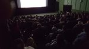
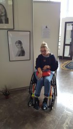
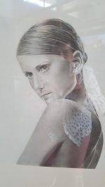
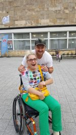
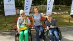
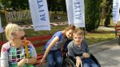

Wszystko co fajne jak to zwykle bywa, szybko się kończy. Obiecałam sobie, że na bieżąco tj. dzień po dniu będę zdawała relację z **międzynarodowego festiwalu filmowego Integracja Ty i Ja**. Od piętnastu lat odbywa się cyklicznie co roku w Koszalinie. Niestety nie dałam rady. Człowiek nie jest w stanie fizycznie wszystkiego ogarnąć. Pełen szacunek i podziękowania dla organizatorów imprezy, oni dali radę, dopięli na ostatni guzik.

Od 04.09.2018 do 08.09.2018 r. od 9.30 (dla widzów) do 22.00 pokazy filmów, spotkania z ich twórcami, bohaterami. Imprezy towarzyszące: happeningi, marsz ulicami miasta, gdzie gros ludzi również na wózkach zaprasza przypadkowych przechodniów na imprezę. Pomysł się sprawdza, jestem zaskoczona dużym zainteresowaniem. Koncerty zespołów muzycznych, które w czarodziejskich rytmach „roztańczyły” całą widownię. Wystawa zdjęć autora ukazująca chwile zwykłego dnia osób z niepełnosprawnością z rodziną, a nie raz takie zwyczajne chwile są niezwykle i przez to  i piękne dla ludzi w pełni sprawnych. Portrety malowane długie godziny przez człowieka bez rąk.  
  
  
Ten najbardziej mi się podobał. We wrześniu od kilkunastu lat o porze staję się naocznym świadkiem i uczestnikiem na żywo pięknej imprezy "Integracja i Ty i Ja". Najpierw uliczny happening, gdzie grupa ludzi z różnymi, niespotkanymi sprawnościami przypadkowym przechodniom przekazuje zaproszenia na ta imprezę.

Zaskoczyła mnie deklaracja udziału w tym festiwalu. Zespół teatralny Recepta - kilku fajnych młodych ludzi z tej grupy przedstawia szczęście i radość w rodzinie z okazji narodzin dziecka, które przeradza się w dramat i płacz. Okazuje się, że potomek jest niepełnosprawny, cała rodzina odwraca się plecami. Z dzieckiem pozostaje jedynie matka, ze strachu i wstydu chowają się w ciemnościach domu. W życiu słyszy szyderczy śmiech, spotyka wiele przeszkód tworzonych przez mało tolerancyjne społeczeństwo. Ostatecznie po wielu bojach zostaje zaakceptowany w środowisku. Wcześniej pisałam, że jestem stałym bywalcem festiwalu, widziałam dużo koncertów, ale tak jak przy zespole Novembert Prolect nie bawiłam się nigdy. Kolorowe postaci bujające się na scenie w rytmie muzyki reagge sprawiły, że widownia wstała ze swoich miejsc, ja też "pobujałam" wózkiem pod estradę a nawet na scenę. Dawno tak fajnie się nie bawiłam,w towarzystwie m.in. Sebastiana Stankiewicza, naładowanego bardzo pozytywna energią.  
  
W tym roku udało mi się obejrzeć prawie wszystkie projekcje filmowe. Szczerze współczułam szanownemu jury, jak wybrać laureata gdy wszyscy są zwycięzcami, bohaterami ,medalistami? We wszystkich tych filmach niepełnosprawność jest przedstawiona smutno i radośnie, osobiście serdecznie polecam film pt. „Downside  Up” laureata festiwalu w kategorii filmów fabularnych. Wielką sympatią natomiast darzę parę bohaterów filmu dokumentalnego pt. ”Zołza i Perła”. Ewelinę i Łukasza bo o nich mowa poznałam osobiście, trudno sobie wyobrazić co musieli przejść aby być ze sobą. Są i są wspaniali.  
  

Ode mnie nagroda dla filmu pt. ”Ciche dziecko” – film o ludziach, którzy z racji swojej choroby nie mogą mówić - tutaj z racji swojej ułomności dołączam do nich, i w tym filmie potwierdza się, co od kilku lat mówiłam. Jak ktoś nie mówi, to przez wielu ludzi uznawany jest za głupią osobę i wciąż nikt się nie pyta dlaczego tak jest. Pierwszy raz zobaczyłam tak duże skupisko wózkowiczów. Najbardziej spodobał mi się wspólny późny spacer w kupie kilkunastu osób "pieszo"na kółkach przez ulice Koszalina. Niestety fotki nie mam.

**Dziękuję za niezapomniane przeżycia. Do zobaczenia za rok o tej samej porze.**
