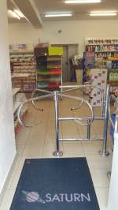
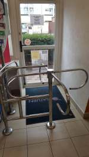
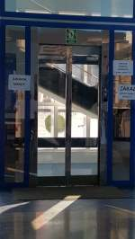

Odnoszę wrażenie, że staję się monotematyczna, ale nie mogę przemilczeć i udawać, że nic się nie stało. Miałam do kupienia czajnik, ktoś powie, ale problem - odwiedziny w Domu Handlowym w centrum Koszalina i sprawa załatwiona. Otóż okazuje się, że niestety ja tam zakupów po raz kolejny nie dokonam. Schody przy wejściu głównym, ale była nadzieja - jest drugie wejście z poziomu zero. Nic z tego, wejście zablokowane dla mnie (nazywam to wiatrakiem) , wózek się zwyczajnie nie mieści. Wspomniałam, że była to kolejna moja próba zakupów w tym sklepie. Po raz kolejny nieudana. Nie będę cytowała słów pań ekspedientek, zażądałam rozmowy z koordynatorką organizacji pracy w tej placówce. Śmiałam się w duchu słysząc jak panie wzajemnie się wypychały do reprezentowania firmy w rozmowie ze zwykłym klientem. Usłyszałam, iż wiatrak zamontowany przy wejściu przede wszystkim ma za zadanie uniemożliwić ucieczkę złodziejowi i świetnie się sprawdza. Mało prawdopodobne, aby coś w organizacji uległo zmianie. Otrzymałam ustną deklarację przekazania mojej petycji do zarządu spółki. Był to już mój kolejny monit i do dzisiaj nic się nie zmieniło. Pozostało mi jedynie udać się do siedziby spółki z dziewiątym artykułem Konwencji ONZ o prawach osób niepełnosprawnych w ręku, ratyfikowanym przez władze Polski w 2012r. który mówi w wielkim skrócie: ”Dostępność odnosi się do zapewnienia osobom niepełnosprawnym na równi z innymi obywatelami samodzielnego dostępu do środowiska zabudowanego, transportu, informacji i komunikacji międzyludzkiej.”

W Konwencji zamieszczono jeszcze jedną ważną definicję, która w polskim prawie jest interpretowana wręcz odmiennie. „Racjonalne dostosowanie” wg Konwencji to szukanie optymalnych rozwiązań, bardziej użytecznych dla wszystkich ludzi (wszystkich grup osób niepełnosprawnych), a w praktyce polskiej: ‘to szukanie rozwiązań najtańszych, które będą spełniały wymóg Prawa budowlanego’82.

Wspomnę na koniec, że za brak dostępności we Francji wymierzane są wysokie kary finansowe, wielokrotne uchybienia doprowadzają do zamknięcia placówki.

Tak się złożyło, że miałam w tym dniu również mile zaskakujące chwile. Podejrzewam, że nikt z nas nie lubi załatwiać spraw urzędowych. W koszalińskim ratuszu miałam do podpisania kilka dokumentów w biurze na drugim piętrze. Pech, właśnie w tym dniu popsuła się winda. 

**O zgrozo J E D Y N A!**

Podsumuję pracę urzędu, odpowiedni ludzie na odpowiednich stanowiskach. Jeden telefon z parteru do biura na piętrze i po chwili miałam  przed sobą dokumenty do podpisania, które nie mogły czekać do jutra. Można? Wszystko zależy od ludzi. **Brawo!**

Przepisy, przepisami, a samo życie ustawia nam drogowskazy, którymi próbujemy przeforsować spotkane po drodze przeszkody, bariery.
