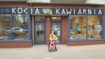
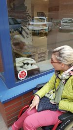
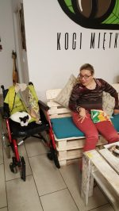
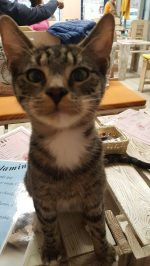
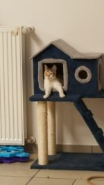
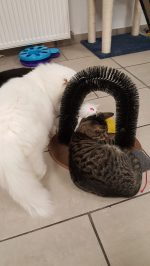

**Zwierzaki w kawiarni**. Tak to nie pomyłka, kilka kotów (bo o nich mowa) od kilku miesięcy pomieszkują w kawiarni.  
Widać po ich zachowaniu, kto tutaj jest gospodarzem a kto gościem. Obowiązuje regulamin naszych zachowań do zwierząt. Słusznie, bo efekty  przedawkowanej opiekuńczości mogłyby mieć fatalny zdrowotny skutek dla  futrzaków. Nie ukrywam mojego  zaskoczenia i radości z powodu powstania tego rodzaju pomocy dla kotków (bez domu) w moim mieście. Pierwsze „kocie kawiarnie” poznałam w Krakowie, gdzie byłam częstym gościem. Pomysł  mi się bardzo spodobał, choć sama nie mogłabym sprawować pieczy.  Dlaczego? Dlatego, że lokatorami tzw. na czas określony są koty wyznaczone przez fundację do adopcji. Nie umiałabym oddać w inne ręce  żadnego kociaka. Fajną sprawą wydaje się być współpraca właściciela kawiarni z koszalińskim schroniskiem dla zwierząt. Nadchodzi zimny czas, w kawiarni każdy z nas ma możliwość przekazać karmę, koce itp. Zapotrzebowanie jest duże, ale wiem, że razem damy radę. Pierwsze zamówienie zrealizowane, sprzęt jak widać na zdjęciu został zaakceptowany.
