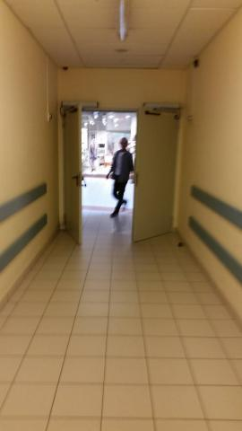
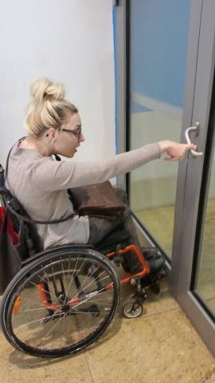
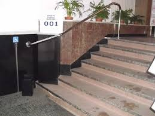
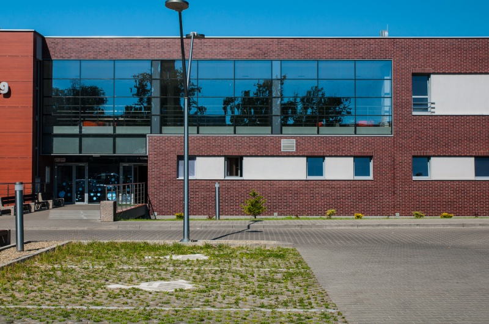

W jednym z ostatnich moich wpisów przekonywałam, że Polacy są całkiem tolerancyjni. Dzisiaj nie mogę tego potwierdzić po obejrzeniu w Faktach TV informacji o radnym z Aleksandrowskiego Kujawskiego. Skandalem nazwę zachowania włodarzy miasta, pomysły na realizację planu czyli spotkania „na szczycie’’ panów przerosły wszelkie granice. Targanie po schodach bez przygotowania?! Brak słów na brak poczucia zapewnienia bezpieczeństwa. Z własnego doświadczenia widzę, że te schody są za strome i za bardzo wysokie. Nie dziwię się jego sprzeciwu o wnoszeniu na pierwsze piętro, bo ja już kilka miesięcy wstecz pisałam, nigdy nie lubiłam i w dalszym ciągu nie znoszę , żeby obce dla mnie osoby łapały mój wózek ze mną na pokładzie. Wnosić i znosić po schodach można tylko z doświadczonym asystentem.

Szkoda gadać, tym bardziej, że nowo wybrany członek Rady Miejskiej uprzedził urzędników o swojej inności. Moim zdaniem wystarczyło „przenieść” imprezę na parter i po problemie. Czasami jestem na siebie zła, że tak pomału piszę, moje komentarze trafiają z poślizgiem czasowym, czyli prawie po temacie. W tym przypadku nawet dobrze się złożyło, kiepska dostępność w miejscach publicznych jest coraz bardziej widoczna i odczuwalna. Ucieszyłam się, że jest coraz więcej chętnych osób z niepełnosprawnością, które lokalnie zaczynają przecierać ścieżki. Wszystko zależy od człowieka ,ważne jest, że się chce. Chcieć to móc.  Radnych na wózkach już dzisiaj widać  w miastach m.in. Toruniu, Nysie, Bochni  i Opolu.

Mam nadzieję, że z czasem zaczniemy wdrażać funkcjonalne projekty.
