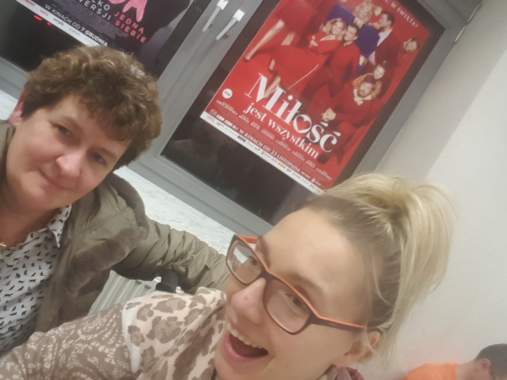

Kilka dni temu obejrzałam w kinie Kryterium, film pt. ”Miłość jest wszystkim”, w ramach programu Szminki Movie. Jest to projekt - pomysł, w którym cyklicznie raz w miesiącu odbędzie się projekcja nowego filmu. Bilet w promocji, pakiet słodkości i niespodzianek dla osób siedzących na widowni. Wszyscy zadowoleni, widownia wypełniona po brzegi (dobrze, że miałam swoje niezawodne stałe miejsce siedzące).

    

    

Na wszelki wypadek zostały już zakupione bilety na przyszłe seanse. W jednym z nich główną rolę zagra moja gwiazda J.L. z czego się  bardzo cieszę. Kino Kryterium jest placówka publiczną dostępną dla osób z niepełnosprawnością. Wyjście do kina dość późną porą dało mi szansę poznać nową szatę miasta-świąteczną. Zapowiada się całkiem ładnie.

    

