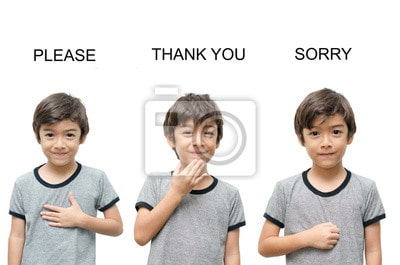
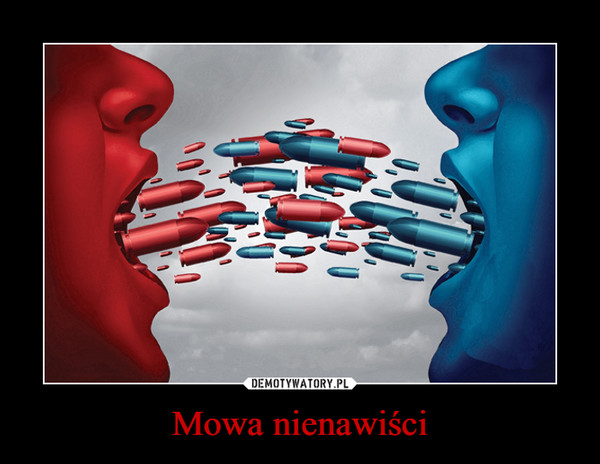
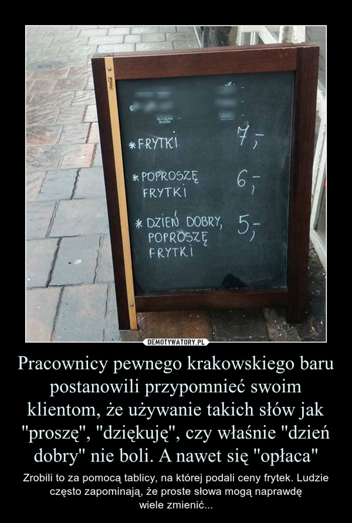

(Papież Franciszek z okna papieskiego do wiernych zgromadzonych na ul. Franciszkańskiej w Krakowie.)

Dam Wam radę: nie kładźcie się spać bez pogodzenia się. A wiecie czemu? Ponieważ zimna wojna następnego dnia staje się niebezpieczna.

A co mam zrobić, żeby się pogodzić?- mógłby zapytać ktoś z Was. Nie trzeba nic mówić- wystarczy gest. I tyle. I już jest zgoda. Gdzie jest miłość, jeden gest wszystko załatwia.

Przykładem mowy nienawiści sprzed kilkunastu dni jest dramat, który wydarzył się w Gdańsku. W niedzielny wieczór 13 stycznia  akurat chwilę po światełku do nieba WOŚP-u zamordowano prezydenta Gdańska. Mam nadzieję, że już teraz wszyscy się będą bać mowy nienawiści, już  wiemy czym to grozi. Może nam się uda  zapobiec  bardzo niebezpiecznym konsekwencjom.

Z historii mojego życia, nie mogę zapomnieć jak  kierowca  MZK nie zniżył autobusu , nie pojechałam, albo innym razem pasażerowie, głośno wyrażali swoje niezadowolenie, mówiąc po co w ogóle wsiadała do autobusu,  już jak wyszła  z domu to na spacer piechotą, na wózku, a nie autobusem, spóźnimy się przez nią. Nie jest to dobry przykład na mowę nienawiści, ale na pewno braku tolerancji. Moją podpowiedzią dla nas wszystkich w walce z mową nienawiści jest więcej naszego uśmiechu ,który jest przecież symbolem szczęścia. Przypomnijmy sobie znaczenie trzech istotnych, prostych słów: proszę, dziękuję, a czasami słowo przepraszam- nikt przecież nie jest idealny.

    

    

Pomyślałam, że może nadszedł czas na oczyszczenie atmosfery. Najlepiej zacząć od własnego kąta i dlatego przepraszam wszystkich za czasami niefajne z mojej strony postępowania, którymi zapewne sprawiłam przykrość i łzy.

