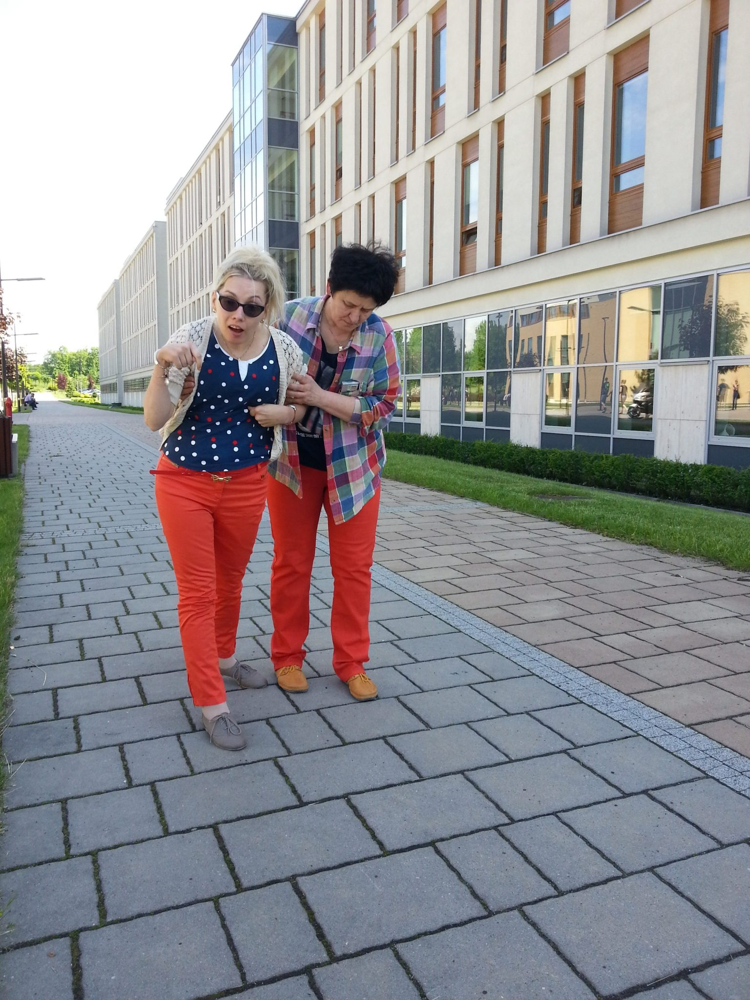

Dziękuję z całego serca mamie Szymka ([publikuję link z relacją z podróży z osobą z niepełnosprawnością](http://facebook.com/alicja.kaiserkonieczna/posts/1998019563566437))

Jestem dorosłą osobą z dużym ograniczeniem fizycznym, poruszam się na wózku w asyście osoby drugiej. W swojej najbliższej przyszłości beztrosko planowałam podróż do Krakowa pociągiem!

Podkreślam beztrosko, dlaczego?

Byłam przekonana o całkowitej dostępności, bez specjalnych warunków podróży dla nas wózkowiczów. Człowiek całe swoje życie się uczy, dzisiaj wiem czego mogę się spodziewać i wymagać od przewoźników transportu publicznego. Zerknęłam do przepisów unijnych dotyczących praw osób z niepełnosprawnością w transporcie publicznym. Są, ale w Polsce obowiązuje tylko klika zapisów, reszta jest jedynie w teorii.

Dlaczego?

Rząd polski poprosił dwukrotnie o pięcioletnią zwłokę, ale tak naprawdę to niepełnosprawni niewiele sami mogą, zaczynając od ramp, które powinny ułatwiać wejście do pociągu, a tak nie jest, bo owe rampy są przeważnie schowane lub popsute , albo brak jest przeszkolonej kadry do obsługi. Częściowe przepisy obowiązują w czterech państwach, w tym Polska, reszta państw w Europie podpisała pełną dostępność dla wszystkich miejsc publicznych. W grudniu tego roku kończą się dla Polski ulgi w przepisach unijnych.

Europejska strategia w sprawie niepełnosprawności 2010-2020 z dnia 15 listopada 2010 r. (KOM 2010 636) Dostępność” oznacza, że osoby niepełnosprawne mają dostęp, na równych prawach z innymi, do środowiska fizycznego, transportu, technologii i systemów informacyjno-komunikacyjnych oraz pozostałych obiektów i usług.

Zobaczymy, swoją podróż pociągiem do mojego kochanego Krakowa przekładam z czystej niepewności na pierwszy kwartał 2020r. Dzisiaj wiem, że zanim wsiądę do pociągu wcale nie byle jakiego (w regionalnym taborze, przepisy unijne dostępności nie obowiązują w żadnym wymiarze), muszę być w 100% pewna: Odpowiedniej ulgi na przejazd (chyba 49% dla mnie, 95% asystent ) Profesjonalnej asyście personelu PKP (od chwili przekroczenia wejścia dworca do momentu zajęcia przeze mnie miejsca w pociągu, następnie na stacji końcowej bezpieczne opuszczenie pociągu).

W Polsce jest sześćdziesiąt miast zapewniających odpowiednią opiekę w podróży osobom na wózkach. Zastanawia mnie jedna sprawa. Nigdzie nie wypatrzyłam warunków wejścia osoby na wózku do wagonu pociągu.

Mam nadzieję, że platformy w końcu znajdą zastosowanie. Wstanę z wózka, zrobię kilka a nawet kilkadziesiąt kroków na własnych nogach, ale wejście schodami do wagonu sprawia trudność osobom tym bardzo sprawnym. Może kiedyś.....

„**Uniwersalne projektowanie to projektowanie produktów oraz otoczenia tak, aby były one dostępne dla wszystkich ludzi, w największym możliwym stopniu, bez potrzeby adaptacji.”**
